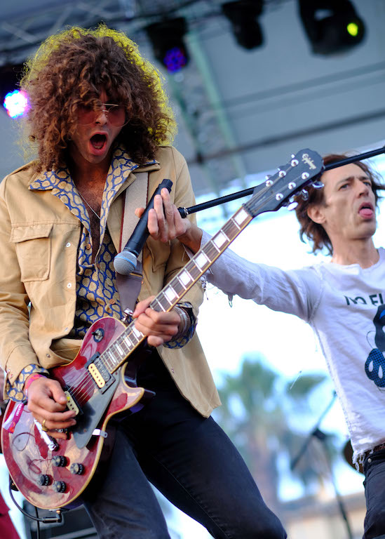
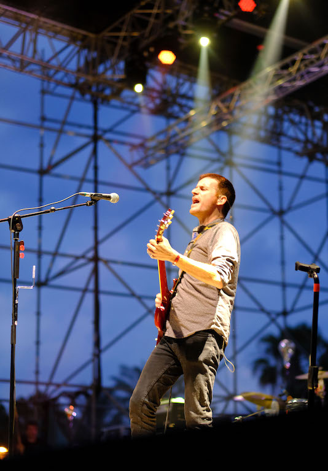
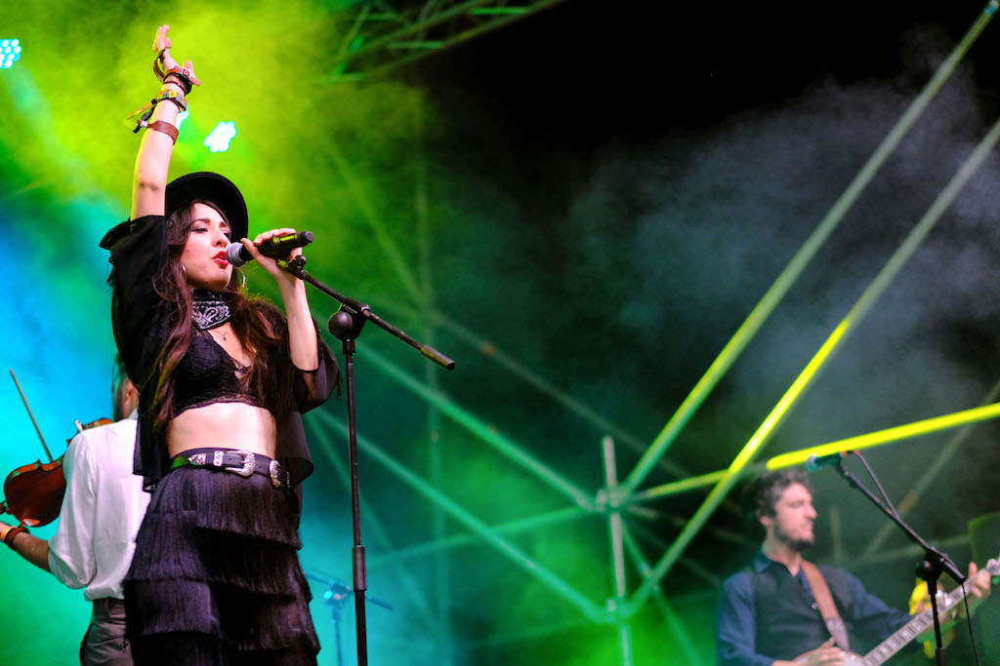
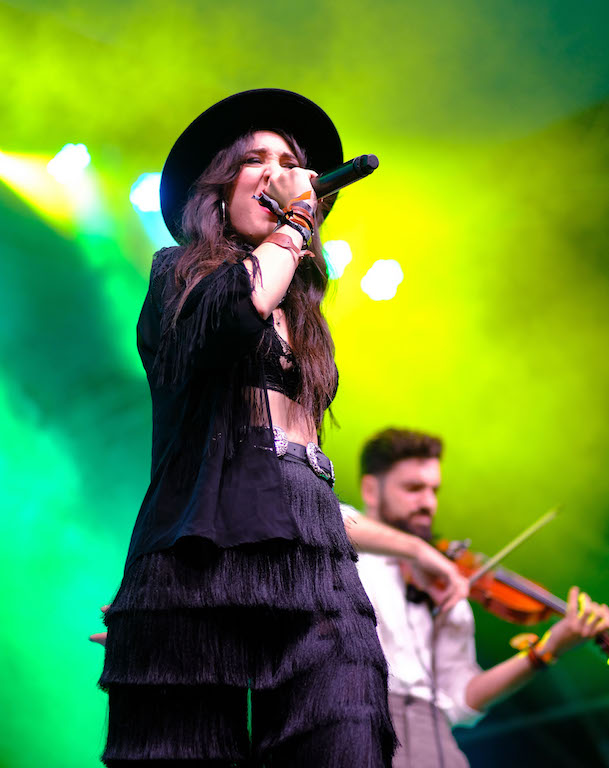
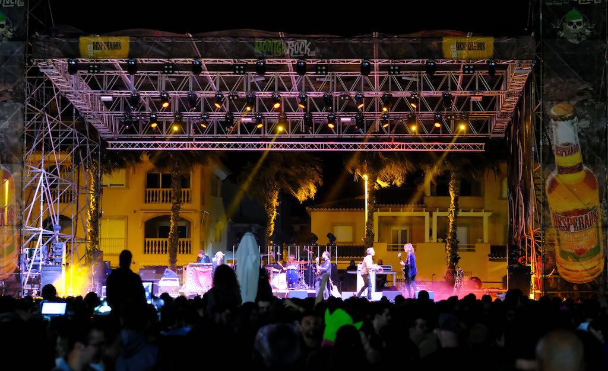
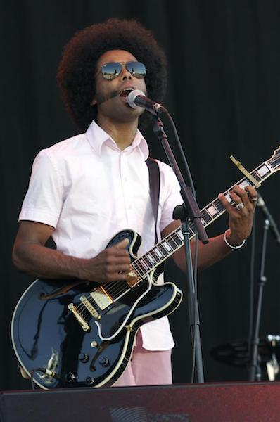
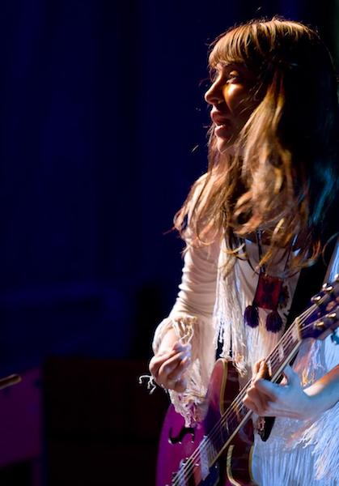
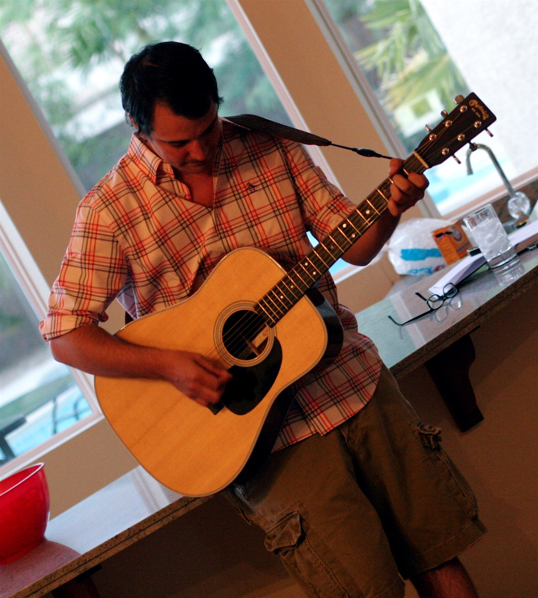
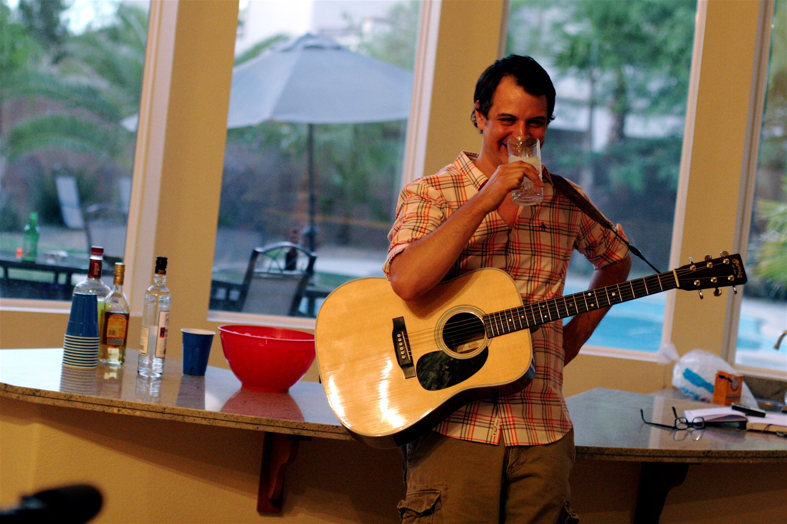
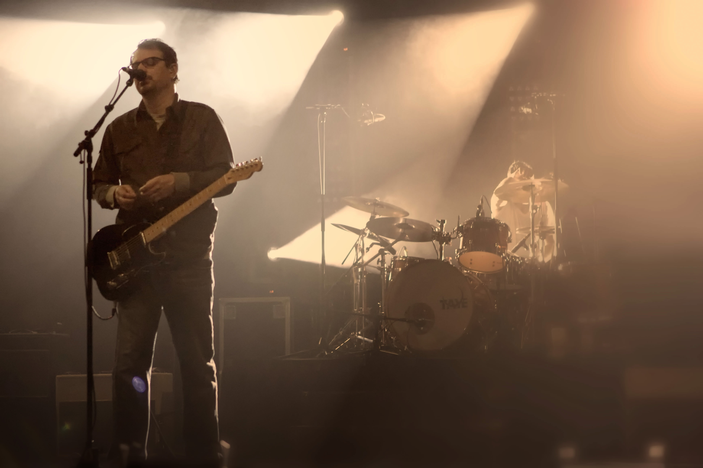

## Montgorock

#### Javea, España

Asistí a Montgorock en nombre de los organizadores en Javea, España, y estuve entre bastidores tomando fotografías durante dos días. Algunos de los talentos musicales que participaron en este evento fueron Indian Hawk, Desvariados, Santero y Los Muchachos, Los Labios, Sidecars, Badlands y Gran Cañón.

## BC Festival 150

#### Victoria, Canadá

Estuve entre bastidores en las celebraciones del 150 aniversario de la provincia de Columbia Británica en Canadá. A pesar de no ser el fotógrafo principal para el evento, la mayoría de mis fotografías fueron compradas por los organizadores del concierto para usarlas en sus folletos oficiales. Los artistas que participaron en este evento histórico fueron Feist (Leslie Feist), Sarah Mclachlan, Burton Cummings, Alex Cuba y más.

## Los Premios Canadienses Juno

#### Calgary, Canadá

Fui uno de los 15 fotógrafos internacionales seleccionados para estar detrás del escenario durante los Premios canadienses Juno (el equivalente a los premios Grammy estadounidenses) en Calgary, Alberta. Músicos y presentadores notables durante el evento fueron Michael Bublé, Leslie Feist (Feist), Blue Rodeo, Jim Cuddy, Sophie Milman, Estado de Shock, Jessie Farrell, Aaron Pritchett, Lindsay Ell, y el comediante Russel Peters.

## Matthew Good, Evento Privado

#### Las Vegas, EUA

Fui invitado a un pequeño y privado show en nombre del ganador de múltiple premios Juno [Matthew Good ](https://en.wikipedia.org/wiki/Matthew_Good) en el desierto de Las Vegas. Matt nos deleitó tocando la guitarra, y luego todos celebramos su cumpleaños.

## Matthew Good, Varios Recorridos

#### Internacional

Fotografié varios conciertos para Matthew Good durante varios de sus giras internacionales, incluyendo pequeñas reuniones íntimas en bares locales, un concierto privado de la víspera de Año Nuevo en el bar de [Dale Earnhardt Jr](https://en.wikipedia.org/wiki/Dale_Earnhardt_Jr.) en Carolina del Norte, y detrás del escenario en el prestigioso asiento de 3500 canadienses [Massey Hall](https://en.wikipedia.org/wiki/Massey_Hall).

