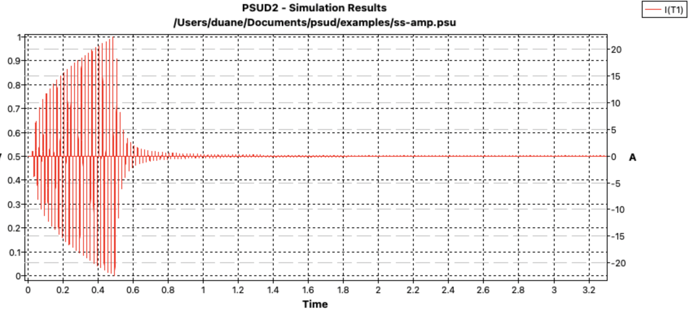
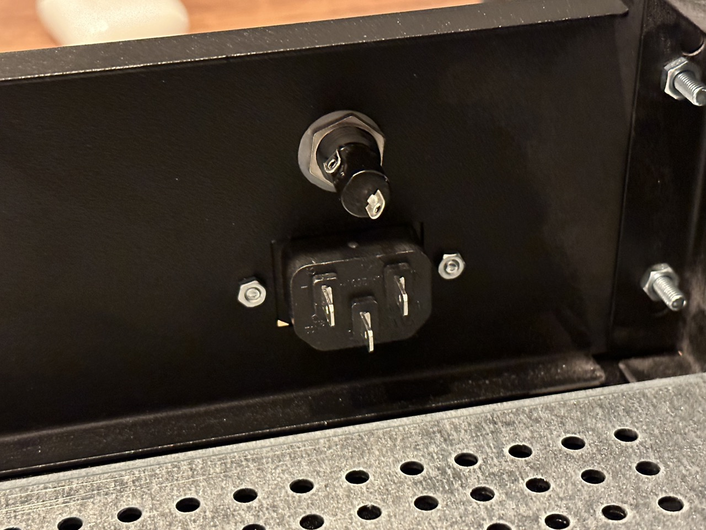

Once the chassis is assembled, the next step is to install the IEC power socket and fuse. The IEC socket is a standard size, but make sure you match it for whatever chassis you have. For safety reasons, it’s also important to ensure that the mains power supply is fused, that way if there is some type of catastrophic failure, the fuse will limit the damage that can occur (which is important, especially if the failure is damaging you).

The fuse holder I’m using is 5x20mm chassis fuse holder. This holder works fine, but I find the spade terminals on it a little flimsy. I broke one of these on my prototype unit, and had to replace it. If I ever find anything slightly stronger, I’ll switch to it.

In terms of the fuse you use, it should be sized according to the power your transformer can potentially use. My custom made transformer has a power rating of 300VA, which means at 230V mains voltage it needs to be able to handle at least (300VA/230V) = 1.3A. So in my case, I’ll install a 1.5A slow blow fuse.

It’s important to use a slow blow fuse here, because on initial power-on the rectifier surge currents that are needed to charge the main capacitors will be extremely large. On 500VA transformers with 120V mains, these surge currents can easily hit 100 Amps. The simulations I did while designing my power supply unit show my surge current will hit 22 Amps on power up. These currents, when large enough, can damage equipment or significantly reduce the lifespan of some. That’s why on most transformer over 300VA, a soft start circuit is requirement (more on this later) to help reduce those currents to something manageable.

PSUD2 Simulation Showing 22 Amp Spikes

If you look at most wiring on the primary side of a transformer, or even the interconnect wires to the transformer, they are often quite small. Yet how can small wire handle 100 Amps of current? In reality those current spikes only happen for a very short time when the rectifier diodes on in the “on” state, and then quickly go to zero again. On average, the currents work out to something reasonable, so the wires and other components (such as the mains breaker, which is often only 15-20 Amps on a receptacle circuit) can typically handle it.

But a fast blow fuse here will pop immediately with those types of currents. Try not to over-size this fuse very much as small deviations in the fuse’s value can cause large increases in the current it can handle and the time it takes for the fuse to blow. For example, a 2 Amp slow-blow fuse can handle 10 Amps of continuous current for a little over a second. That’s a long time with a lot of current, especially since that current likely won’t trip the main breaker. So try to size this as close to your requirements as possible.

Installed IEC Power Socket and 5×20 Fuse Holder

To install the IEC socket, I used a M3x6mm screw and nut (a screw size that’s used often during this project).

Once the fuse holder and IEC sockets are in, it’s time to work on the main safety connection.