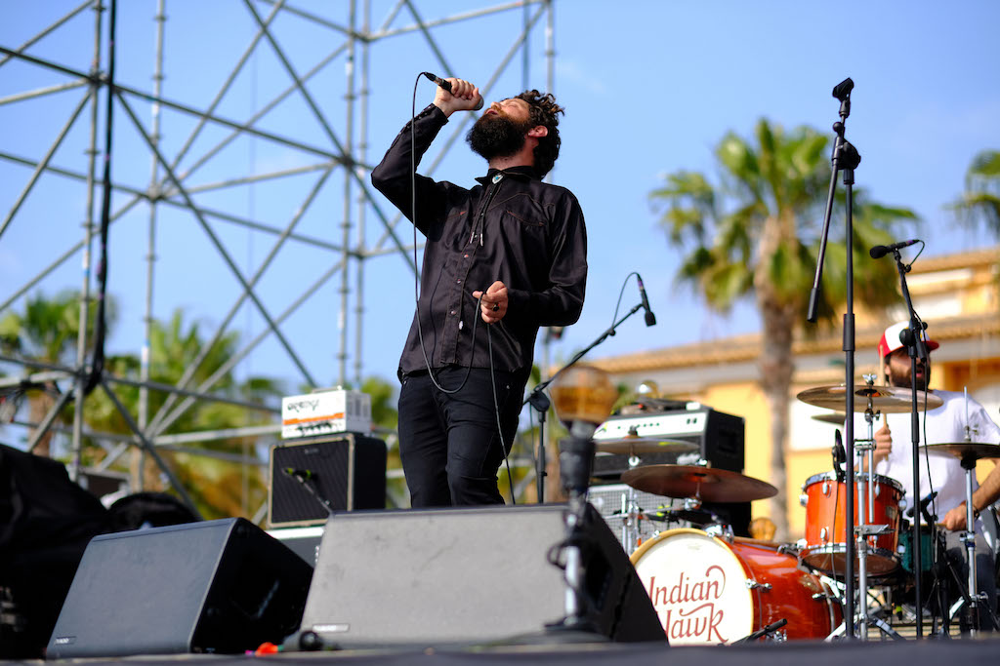
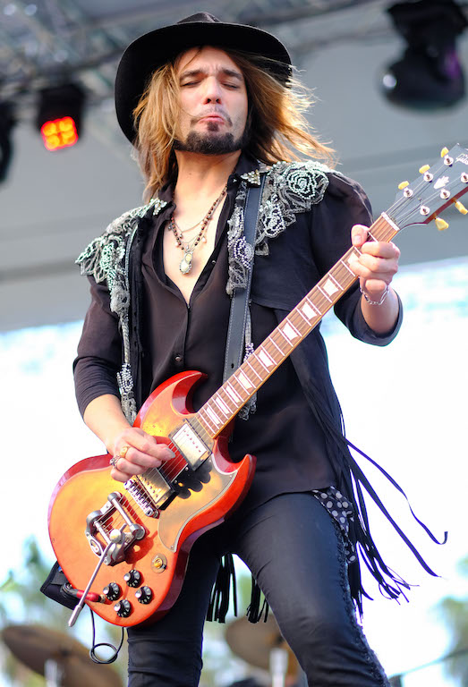
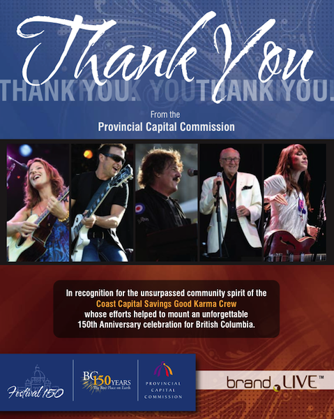
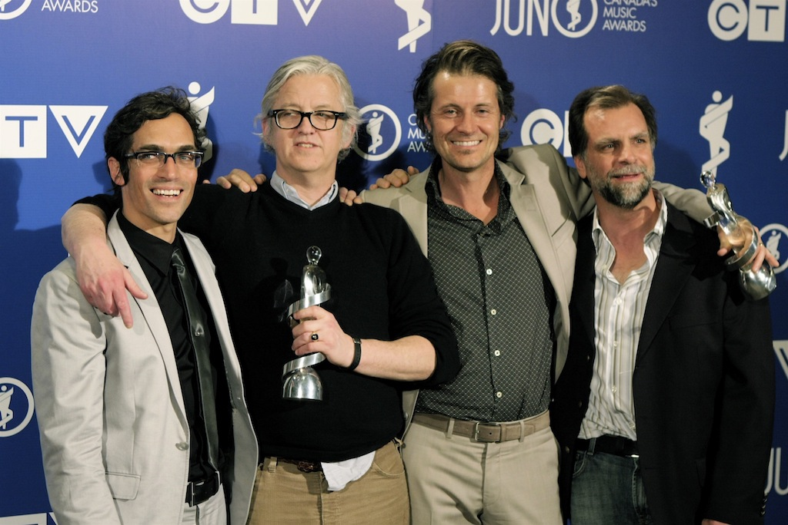
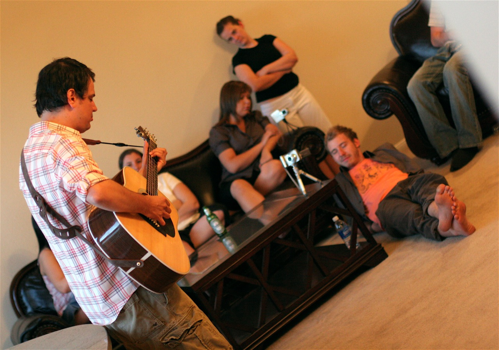
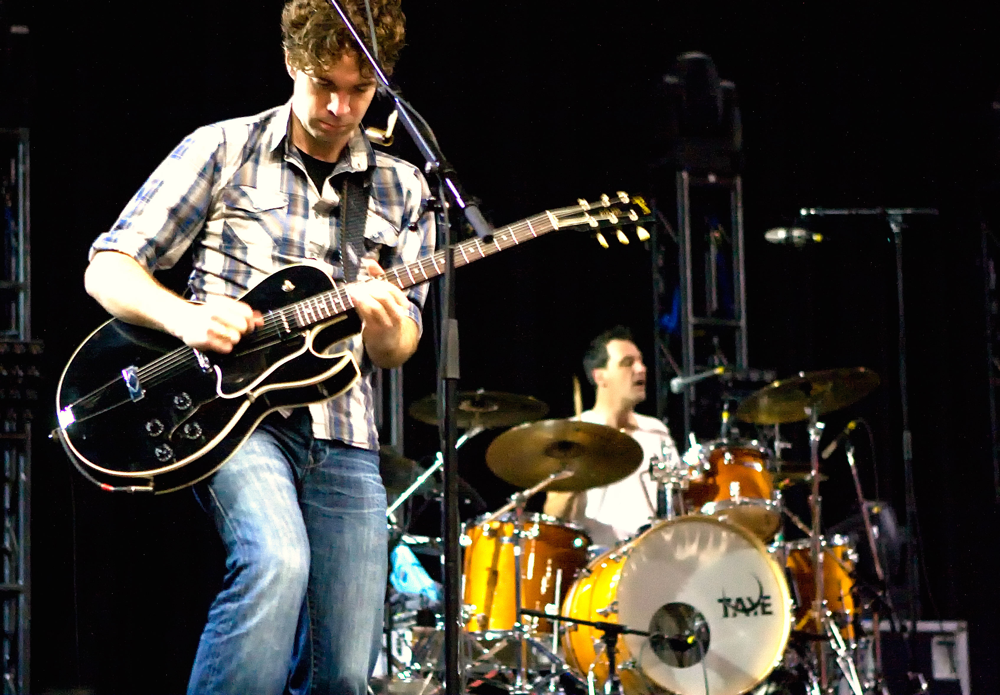

## Montgorock

#### Javea, Spain

I attended Montgorock on behalf of the organizers in Javea, Spain, and was backstage taking photographs for two days. Some of the musical talent that participated in this event were Indian Hawk, Desvariados, Santero y Los Muchachos, Los Labios, Sidecars, Badlands, and Gran Cañon.

## BC Festival 150

#### Victoria, Canada

I was backstage at the 150th anniversary celebrations of the province of British Columbia in Canada. Despite not being the primary photographer for the event, the majority of my photographs were purchased by the concert organizers for use in their official brochures. The artists that participated in this historic event were Feist (Leslie Feist), Sarah Mclachlan, Burton Cummings, Alex Cuba, and more.

## Los Premios Juno Canadiense

#### Calgary, Canada

I was one of 15 international photographers selected to be backstage during the Canadian Juno Awards (the equivalent of the American Grammy Awards) in Calgary, Alberta. Notable musicians and presenters during the event were Michael Bublé, Leslie Feist (Feist), Blue Rodeo, Jim Cuddy, Sophie Milman, State of Shock, Jessie Farrell, Aaron Pritchett, Lindsay Ell, and comedian Russel Peters.

## Matthew Good, Private Event

#### Las Vegas, USA

I was invited to a small, intimate private show on behalf of multiple Juno-award winner [Matthew Good](https://en.wikipedia.org/wiki/Matthew_Good) in the Las Vegas desert. Matt played a small set, and we all celebrated his birthday afterwards.

## Matthew Good, Various Tours

#### International

I photographed several concerts for Matthew Good during several of his international tours, including small intimate gatherings at local pubs, a private New Year’s Eve concert at [Dale Earnhardt Jr](https://en.wikipedia.org/wiki/Dale_Earnhardt_Jr.)‘s bar in North Carolina, and backstage at Canadian’s prestigious 3500 seat [Massey Hall](https://en.wikipedia.org/wiki/Massey_Hall).

