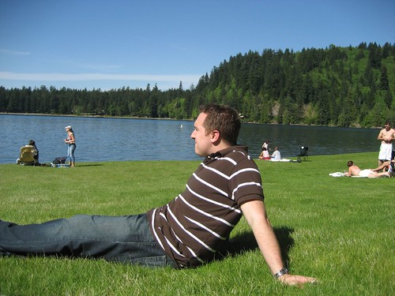

So I woke up this morning, and slowly made my way to Chilliwack so that I could hang out with my mom and grandma on Mother’s Day. It was a beautiful day for a drive through the Fraser Valley, hovering between about 20C near Vancouver to about 26C in Chilliwack. After visiting mom and baba, I went with Amanda, Andie and the kids to Cultus Lake to relax near the water for a while. Cultus Lake is easily my favourite campground in North America. I realize that I’m probably biased, since I grew up near Cultus, but having been up and down the East and West coasts of North America, I haven’t found an equal to Cultus anywhere. Spending time near the water made me realize that I need to start planning some major camping trips for the summer. I’m also tentatively planning to take the week off before Canada Day and do a major roadtrip. Right now the plan is to hit Lake Louise, head south to the Grand Canyon, west to Las Vegas and California, and then slowly make my way up the Oregon Coast. Everything is still up in the air though.

I saw Poiseidon last night with Brennen and Dave. It wasn’t very good, so don’t waste your money on it. Tonight I’m thinking about cleaning up, and maybe going for a walk near the water. Other than that, nothing else really new. I’m check in tomorrow with the results from week one of the big summer workout program.

Here’s a shot of me near Cultus.? I’m not sure what the hell I was doing with my face.

