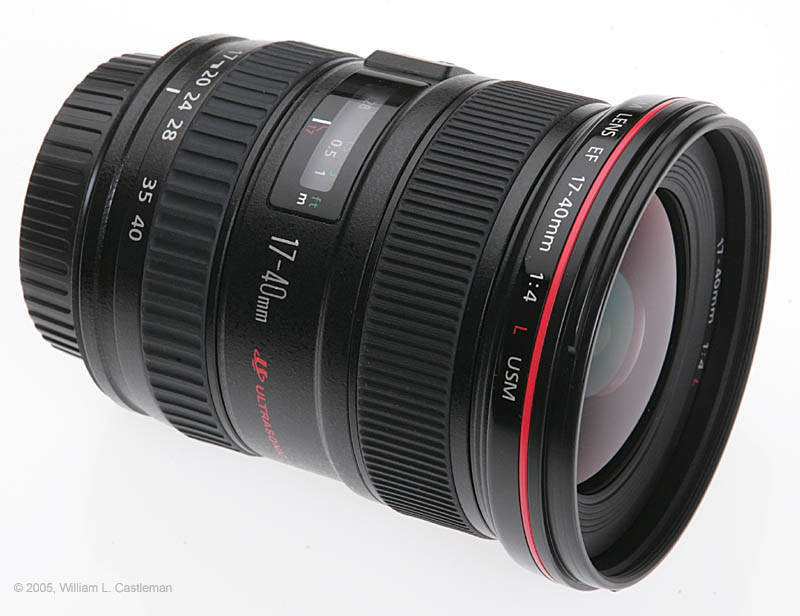

About 18 months ago, I picked up the Canon EOS 20D to replace my dying Canon Powershot camera. Stepping up from a point and shoot to a digital SLR was a pretty big step for me at the time, since I had never even really used an SLR camera before. I made a rookie mistake when I got it, and instead of buying a nice lens to go onto it, I picked up a cheap Sigma zoom lens. I spent the first few weeks completely disappointed with my camera, thinking that my point and shoot pictures were nearly as good as the ones coming off my SLR. After reading the newsgroups, I basically figured out that I needed to ditch the cheap lens I got, and go with something a little nicer.

Thankfully the store took the Sigma back, and I walked away with the Canon EOS 28-135mm IS lens. This is a great all around lens, and it’s one that many Rebel/EOS people leave on their camera body most of the time. Since the EOS 20D has a 1.6x crop factor, that lens is actually equivalent to a 44-216mm lens on most cameras. I’m pretty happy with this lens, although sometimes I find it a little soft.

The next lens I picked up was the Canon EOS 50mm/f1.4 lens. This is one of Canon’s flagship lenses, and it often the lens that’s shown on a new camera when it hits the magazine covers. It’s probably one of the sharpest lenses around with the ability to resolve around 120 lp/mm I believe (the 28-135 only does around 50-60 lp/mm if I remember). The f/1.4 speed gives you an incredible amount of creative freedom when it comes to depth of field. When the lens is wide open, the focal plane is the size of a thin sheet of paper, so hardly anything will be in focus (which gives some really cool effects). If you bump up the ISO on the Canon 20D body (which can go up to ISO 3200), you can easily shoot with this lens in a dark bar or concert hall without a flash. With the 20D 1.6x crop factor, this lens goes from being a 50 mil prime to a 80mm, which makes it a pretty decent portrait lens.

While I’m really happy with these two lenses, I think that I miss having a wideangle enough that I’m ready to drop $1000 on a new lens for this camera. I’m at that point though where I can’t make up my mind. I’ll post the lenses I’m looking at, and maybe some people can offer some suggestions.

The first lens is the EF-S 10-22mm. This is a new lens from Canon that is designed specifically for digital SLR bodies (the -S in EF-S refers to a short back focus). What that means is that this lens, while really cool, cannot be used on normal SLR bodies (it must be used with digital cameras that have a EF-S mount). I’ve purposely shied away from buying EF-S lenses, simply because I know that in a year or two more and more cameras are going to have large CCDs that will eliminate the need for the EF-S line (and remove the 1.6x crop factor). I’m still a few years away from upgrading my camera body, but I’m not entirely sure I want to get this lens and be locked into EF-S style bodies. On my 20D, this lens gives a 17-40mm converage. Robert has this lens, and he really likes it. So it’s definitely high on my list of lenses to test out. Price tag on this one is around $1050 or so I think.

The next lens, and my favourite so far, is that Canon 17-40mm/f4.0L. This is a great lens, and it typically gets high reviews. Some people knock it because of the f4.0, which is pretty slow for a lens. However, on the 20D, most people just compensate for this by raising the ISO one stop (on a 20D, ISOs up to around 800 are relatively noise free). I’d really like to have some L glass in my camera bag — people say once you try out L, you just can’t go back. My 50mm prime is so amazingly sharp that it’s tough to readjust back to my zoom lens. This lens is around $900 right now. What’s interesting is that a characteristic of Canon’s L series lenses are that within the lens are usually several aspherical pieces of glass, one of which is usually made out of a low dispersion material. The 10-22mm lens also has this type of setup, but for whatever reason, Canon refuses to designate any EF-S lenses as “L”, probably because they don’t want to have professional photographers abandoning the expensive professional Canon lines and going with the prosumer 20D style cameras.

The final lens I’m looking at is the relatively new EF-S 17-55mm f/2.8 IS lens. Once again it’s a short focus lens, meaning it can only be used on a digital camera body. What’s nice is that Canon has included image stabilization in this lens, and also added a constat aperature for the entire range of the zoom. This is another lens that probably should be designated with a “L”, but for the reasons mentioned above, Canon hasn’t called it that. I think this one runs around $1000 as well.

I’m also open to suggestions for non-Canon lenses. I hear Sigma makes a nice EX series lens for digital cameras. I’m heading away this weekend to go camping, so I’d really like to pick up a new lens before then if I can part company with the cash. We’ll see.