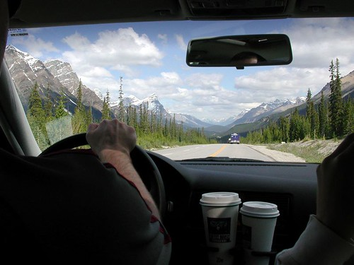

First off, I met with my supervisor tonight to finalize my thesis.. Although I don’t have an official answer yet, it’s very likely I’ll be giving my defense next Thursday.. That’s really soon, and I have a lot of work to do before then, but the good news is then I’m completely done before I go on vacation, which would be pretty awesome.. There will definitely be booze ‘a flowin ‘a plenty Thursday night if I pull it off. On Friday I’m going to Cirque de Soleil, so I hope that my defense is Thursday so I can go out and get sloshed.

On another note, I found the best way ever to make shitty coffee, should you ever want to attempt this at home. Here’s how:

1. Put water into a kettle and pretend to turn it on (the coffee is shittier if you actually \*meant\* to turn it on, but somehow didn’t)
2. Put two tablespoons of coffee grinds into a coffee press
3. Go work on something else in another room, so you don’t notice that the kettle isn’t actually whistling
4. Come back to the kettle, and grab it, being careful not to burn yourself (since it should be hot)
5. Fill coffee press with water
6. Let mouth water, imagining the sweet flowing taste of warm coffee
7. Come back, fill coffee cup with “coffee”, add cream and sweetener
8. Take a big gulp of coffee
9. The taste of cold coffee that you thought was hot is so amazing that it might cause the muscles in your mouth to tense up simultaneously, ejecting the liquid out all over your sink. Adding cool explosion sound effects at this point makes it more fun.
10. Repeat as necessary

Here’s a photo I took a few years ago from the back seat of Bob’s Jetta when we drove from Vancouver to Edmonton for our friends wedding. This is one of my favourite shots for some reason — a couple coffees, a few friends, the open road, huge mountains, trees and fresh air — it makes me really happy I live in Canada near some of this amazing scenery. I’ll be doing this drive in less than two weeks. I can’t wait.  
