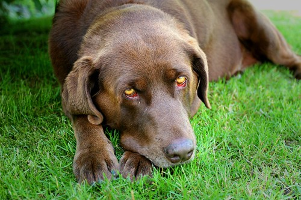

Well, I got back from Chilliwack a few hours ago, and have just been lounging on the couch since then. I had a great time in the wack — I spent Saturday night at my sister’s house, playing with my neice and nephew, and watching a couple of movies. In the morning, we all headed over to my dad’s house to watch him open a few presents. Afterwards, dad, Cathy and I went over to Frank’s house for a nice BBQ.

I’m pretty happy that I finally got to wash and vacuum my car this weekend.. There’s nothing worse than having a new car that’s caked in mud and dust. There’s not much new going on. I have to be at work tomorrow morning for a 7am conference call, so I’m sure I’ll spend most of tomorrow in a sleepy trance. I still have to work on my defense presentation this week, since I’ll have to defend in the next 10 days or so. I’ll be posting some info about the afterparty when that happens.

The photo is of Frank’s dog Brandi.? Apparently Brandi thought I was more interesting than the croquet game that was going on.