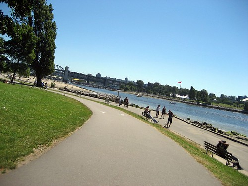

I can’t believe how nice it’s been over the last few days.. I actually have a slight tan going, which is pretty amazing considering how much time I’ve spent indoors lately. I think I’m going to pull a steak out of the freezer, sit on the patio and relax for a few hours.. This is going to be a pretty awesome week. If all goes well, this Tuesday will be my last day as a student, and I’ll be able to put my whole graduate experience behind me. I’ll probably go for a few drinks that night, but I’m more excited about the big pub crawl on Saturday. Some friends and I are going to hit the streets of downtown at around noon on Saturday (Canada Day) and see how much beer we can drink. It should be pretty awesome.

