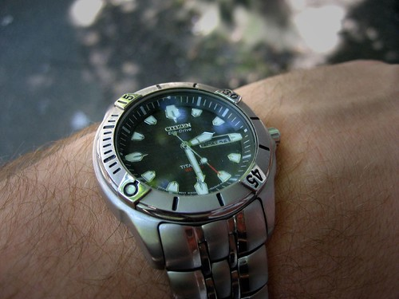

Wow.. Four years doing my master’s degree.. Where does the time go? It seems like only yesterday the wheels of the 737 came off the ground at the Ottawa airport, and I was heading back home to Vancouver to pick up my old life, and start a master’s degree in EE. And here am I, 11pm, only a few hours to go before it’s all over. It’s weird looking back on things like this.. I remember starting school again, thinking it would be so much different from my undergrad, only to realize that after a few classes, nothing really had changed — it was the same boring lectures and crap. I remember one class I sat beside this long haired redneck hippie guy.. At first I thought he was the janitor sitting in on a few lectures, but later I realized he was some American guy doing his education up here in Vancouver. And that’s how Dustin and I first met, way back when (just jokin buddy). Time flies I guess.

Here I am now, practicing my lecture, possibly saying goodbye to my last day ever as a student. I’d like to think that maybe sometime in the future I’ll take some more classes, but I’m not so sure..? It’s been a good time , but after 9 years of school, $50,000 and somewhere in the neighbourhood of 190 credits at UBC, enough is enough.? I met a lot of great people at UBC over the years — many of whom whose weddings I’ve been to in the last few years.  
Anyways, that’s it for now. I don’t really have anything great to say, just that I’m glad it’s over, and in a few more hours I shouldn’t have to worry about doing my thesis ever again. Here’s a shot of my watch at 2:30pm today, exactly 24 hours before my presentation.

