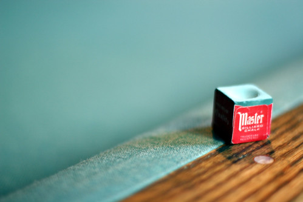

I had one of those days where I just felt completely blah all day – I was tired, I had a migraine, and I didn’t feel like eating anything. By the evening, I could hardly think because of the pounding in my head. I eventually caved in and took a Tylenol-3 after the four of five regular tylenol didn’t do fuck all during the day. When I was a kid I used to get really bad headaches every few days.. Nobody really could figure it out, and thankfully they eventually died down. But as a kid, I spent lots of time in bed because of these crazy headaches. I think part of the reason I felt so crappy today is that I just haven’t had a good nights sleep in I can’t remember how long. Lately I just toss and turn most of the night. I’m really hoping that I can find some peace and quiet in the rockies and actually sleep for 12 hours a night or more to finally catch up on sleep. I figure that still leaves 12 hours of drinking every day, which is probably enough.

On another note, I finally found time to go get some new glasses. I haven’t worn any in about a year since my current glasses don’t do the job any more. My ultimate goal is to get contacts I guess, but at least for work, it’ll be nice not to have to squint at my computer screen all day.

