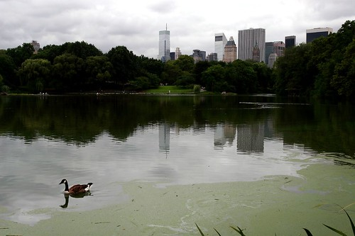
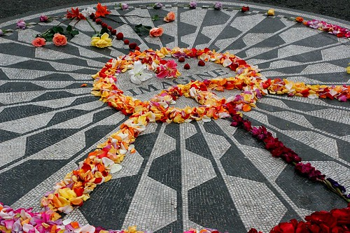
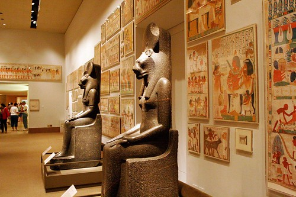
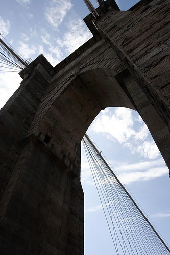
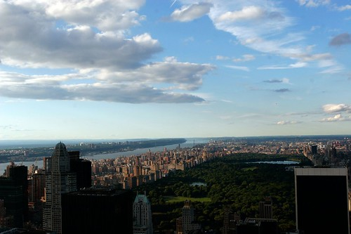

So on day 3, I had decided that I just needed to do something fairly relaxing to unwind. What better place for that than Central Park I thought. So, I grabbed a coffee, and made my way North a few blocks to Columbus Circle, which is at the south-east corner of Central Park.

I can honestly say that Central Park was the one part of New York I wasn’t prepared to see. Here in Vancouver, we talk about Stanley Park like it’s the greatest thing since sliced bread. And don’t get me wrong, it is beautiful. But I think in Vancouver we take a lot of things for granted because they exist in nature. I’ve often compared Vancouver to other places, and unfortunately, it scores pretty low in my mind in terms of the current state of the city. Now don’t get me wrong, I love living here. But I often ask other people, if you were to take the nature away from Vancouver, would you still love the city as much? Other cities like Ottawa don’t really have alot of nature, and so there is a lot more to see and do there. I think Vancouver relies too much on it’s geographical location to attract people here, instead of also putting effort into adding onto the city and making it better. So why I think Central Park is so amazing is that in New York, in Manhattan, on some of the most valuable real estate in the world, lies one of the prettiest pieces of nature I’ve seen. It’s full of green grass, huge trees, pathways, bikeways, carousels, skating rinks, lakes, running paths, and places to sit and think. I spent hours and hours in here, and I loved every second of the solitude.

One of the most popular places to visit in the park is Strawberry Fields, a memorial dedicated to John Lennon. I’m not a huge beatles fan, but I appreciate the influence they had years ago, and the influence they still have today, long after they parted ways with each other. At the western edge of Strawberry Fields is a tiled mosaic that fans cover in rose-petals everyday.

On the eastern edge of the park, on 5th avenue, lies a few world renowned museums such as the Met and the Googenheim. I decided to spend a few hours walking around the Met.

When I was down in Lower Manhattan on day 1, I was pretty worn out, and so I didn’t get a chance to go check out the Brooklyn Bridge. After leaving the Met, I walked around the park a bit more, then grabbed a subway back to Manhattan to walk across the bridge.

I ended off the day with a visit up the Rockefeller Center. While not as tall as the ESB, the Rockefeller Center (known as The Rock) offers some great views. In fact, while the ESB is more prestigious, I actually think the views off The Rock are cooler, since you can actually see both the ESB and Central Park from the Rock. Here’s a shot of Northern Manhattan from The Rock — notice how large Central Park is in the middle  
