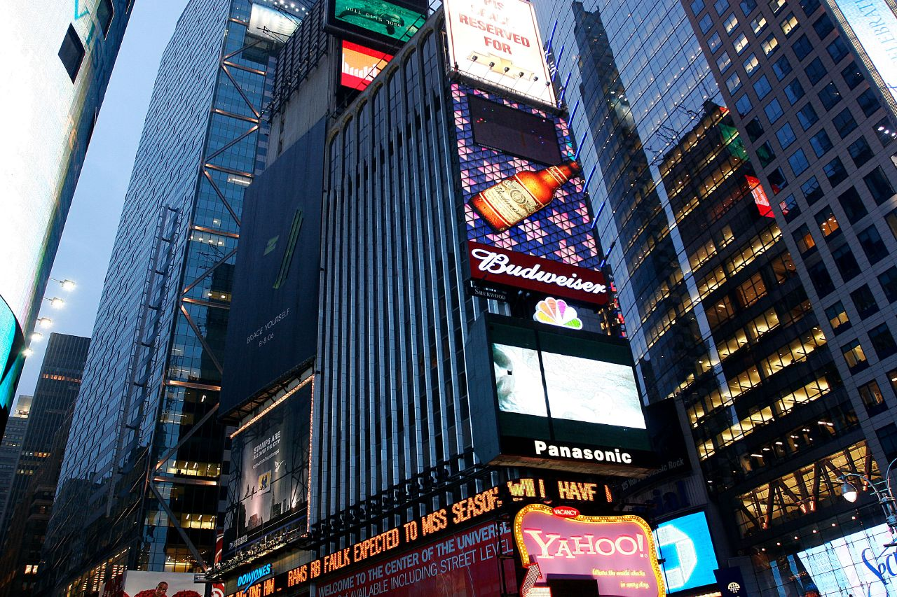
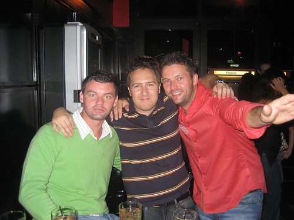
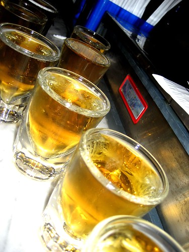

Unfortunately, the night before I left for New York City turned out to be a gong show. Mark, Donovan, Chris and myself went out to the bar for a few drinks, but we didn’t stop until around 2am. I figured, no problem right — I still have 4 hours to sleep and pack before leaving for the airport. Needless to say, Friday morning was really rough, and I was completely exhausted and hungover.

What made it worse is that our plane was broken. After 30 minutes of waiting past of scheduled boarding time, finally the Harmony Airlines representative comes out and says “due to a minor technical problem, we’re going to be a bit late. We’re having trouble getting a replacement part down here.” I have an active imagination, so at this point I have images of a few hungover forklift drivers laughing their asses off while carting two new engines down to our plane. I was pleasantly surprised by the lack of duct tape on the wings when I finally took my seat.

We landed at JFK around 6:30pm, which was an hour late (not too bad). I had originally planned to take the subway down to Manhattan, but a nice lady on the plane (also from Vancouver) offered to pay for the cab ride for me, since she was here on business and could write it off. I gladly accepted.

30 minutes later, I got out of the cab on 42nd street, looked up into the dreary thundershowers that had swept New York City that day, and looked up into Times Square.

Times Square in New York City

The hostel I was staying at was called the Swiss 1291. It’s at 55th st and 8th avenue, which is 13 blocks north of where I was dropped off. So, I tightened the straps on my backpack, slung my camera bag over my shoulder, and started the trek through the heart of Manhattan in the rain. The check in procedure was pretty basic — they took all my money, and I stood there looking stupid. The guy gave me a tour of the broken bathroom, then showed me the cupboard where I could have “free bread” if I got hungry in New York, and where I could do laundry if I wanted. The actual room scared the shit out of me when I first saw it. It was literally only big enough to hold three bunk beds tightly packed, and I was to stay four nights amongst five other strangers in this room. Oh well, you get what you pay for I guess.

At this point, I wasn’t really sure what to do with my backpack. I didn’t want anything to get stolen, but I also didn’t want to be hauling 20 lbs worth of shit around New York all day. I pulled out whatever I thought might be worth stealing and stuck it in my camera bag, and shoved my backpack under the covers.

I didn’t really feel too adventurous at this point, but I also didn’t want to sit in the hostel for my first night in New York. I walked through Times Square for around 20 minutes, had my first slice of New York pizza (it wouldn’t be my last), and found a small, trendy bar called Tonic around 47th and Broadway.

I spent about 30 minutes just chatting it up with the female bartender, but I could tell she was tiring of my conversation pretty quick for some reason. Thankfully these two Irish guys walked in and saved the day in terms of drinking. I ended up chatting with them in Tonic for about an hour, having a few pints, then finally we decided to hail our first NYC taxi cab, and go check out what a real club was like. Here’s a shot of Dave (I thought he looked like Jude Law), me, and Aiden (Hugh Jackman?), shortly after arriving at the new club.

  
  
The second place we were at (also Tonic) was a wicked time. They had a few TVs playing some cheezy MTV music videos, but everyone was totally into it, singing, drinking and dancing. Dave and Aiden were happy to drink their faces off as well, and the three of us must have done a few hundred dollars of drinks at this place.

  
  
We ended up staying at Tonic until around 3am, and then found our way into an Irish pub called the Pig ‘n Whistle. We shut the place down (bars close at 4am in NYC), but unfortunately I somehow lost my $450 Titanium watch here (all because I wanted to take a stupid photo showing it was 4am and I was still drinking – the stupid picture didn’t even turn out). I walked back to the hostel, and stumbled into my bunk bed at around 4:30am, much to the delight of my fellow bunk mates.

If you’re thinking about visiting New York City, then considering picking up the [Lonely Planet guide to New York city](http://amzn.to/18OaAx9) to make the most of your trip there.