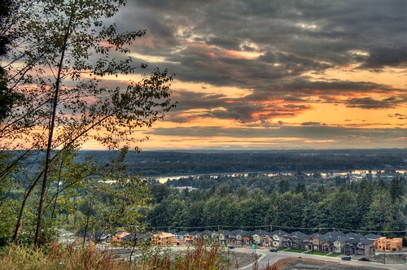
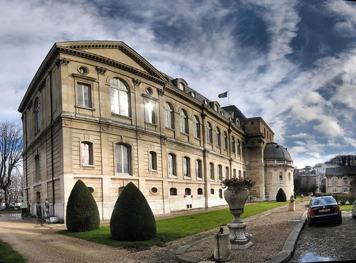

So there’s this buzz amongst photographers about this new technique called HDR (high dynamic range). The basic idea is that a camera isn’t capable of capturing nearly as much dynamic range as what our eyes can capture.? With HDR, you take multiple shots of the same scene using a digital camera on a tripod, and create a new photograph using the information from all the shots. That new image contains a much larger dynamic range than would be possible using any one shot.

Here are some cool examples from flickr.

I bought a new tripod and a remote shutter release for my 20D this weekend, so I might try to do a few of these this week.