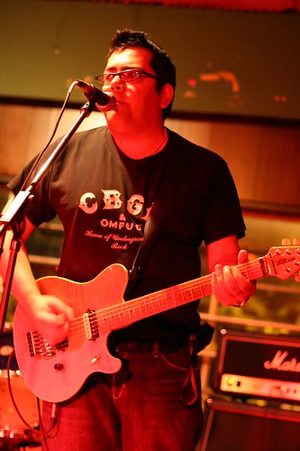

Last night [Clay](http://twitchy67.wordpress.com/) had his big concert down at the Marine Club in Vancouver. A bunch of people from work went to watch, along with [Mel](http://www.2bitstudios.com) and some of her friends. Clay really impressed us all — we had no idea he could do more than like, well, sell stuff. Good job buddy.

I’m going to take it really easy today and stay close to home. I’ve had a few plants die on me over the last few months, so I think I might walk down and get some new ones.. I also might check out a show or two at the Vancouver Film Festival if this throbbing in my head goes away. I’m pretty much out of groceries, so I might go get some (I’m so exciting, I know), or just cave in and make nachos for dinner.