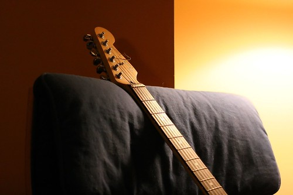

After watching Clay kick some ass at the Marine Club the other night, I decided to go home and wipe the dust off of my guitars and play a bit.. It’s funny — I used to play all the time, but for some reason I rarely pick them up anymore.. I think part of the reason is that I just don’t like either of my guitars. My acoustic was just a cheap piece of garbage I picked up in Chilliwack when I was about 20 years old (it’s not bad to take camping, since you really don’t care what happens to it), and my electric needs some TLC in the electronics that I just don’t have time for (it has developed a weird hum). Plus, I lent my amp to Robbie about a year ago, so my electric is pretty much useless without that.

Lately I’ve been thinking that maybe I’d like to start practicing again and see just how much better I can get. There’s no real point I guess, since I will never be a rock star or anything, but it’s fun sitting on the couch playing guitar, and I would really like to play live once or twice in my life. I really wish I could get a nice Takamine acoustic electric or something, but I really do have better things to spend my money on these days. Maybe in a few months I can re-evaluate again and see how much I’ve been playing.

I went to the gym again tonight, and for some reason, it kicked my ass alot harder than most days. I’ve also decided that the gym I go to is a bit strange. For example, there’s a full bar in the gym. Not just a little place to get a beer, but they have like 4 of 5 tables, bar seating, and a bunch of different beers on tap. It’s literally like 5 steps away from the last cardio machine. Now, I can turn a blind eye to a pop machine sitting in front of the YMCA, but seriously, do they really need a bar that serves beer and nachos in the middle of a gym? Talk about pushing will-power to the absolute limits. Thankfully I can resist, but I’m amazed how many people do a workout and then head into the bar for a pitcher of beer.