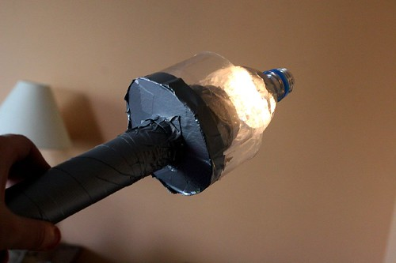
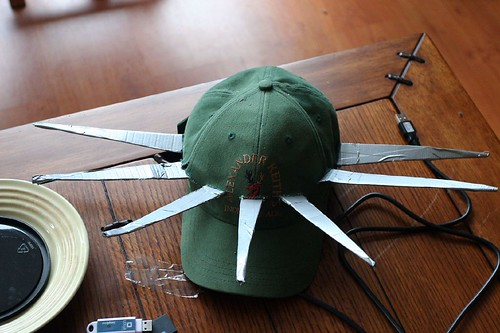

So, I have bounced between a couple of ideas for Halloween this year, humming and hawing about what I was going to be. I woke up this morning and realized that I still didn’t have a costume. Frantic, I started scanning around my living room for ideas.. And that’s when it hit me.. on my floor, in a nice picture frame, was a picture I took in New York back in July.

A picture of the Statue of Liberty.

So, I spent this afternoon putting together a costume of the Statue of Liberty. I made a funky torch out of my camping flashlight, and the hat thing out of a beer hat I had lying around..I think it’s gonna be pretty smoken, although I imagine I’m going to be spearing people in the eyes all night with my hat.

Should be a good night. I still have to make the robe (Dori is bringing over some sheets), but it’s coming together nicely.

