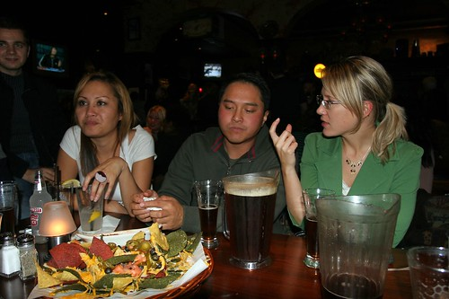
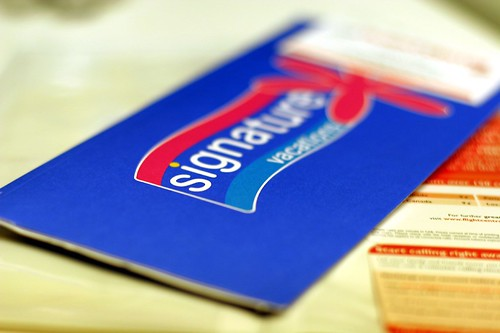

A bunch of us went out to Smiley O’Neils on Friday night for a few beers. It was pretty much my first beer drinking night in the last few weeks, so it was good to get out and just relax for a while.

  
  
Afterwards, some of us met down at the Nelson St. Cafe. to see some live music. I originally went to see [Melanie Dekker](http://www.melaniedekker.com), but unfortunately, she played before we got there. However, the music was still pretty good, and I took some photos.

  
  
Also, in just a few more days, I’ll be boarding a plane and heading south for a week in Mexico. Bob and Candice left last Friday, and are undoubtedly sipping tequila at some pub near the beach right now. I’ll be meeting Joe and Ryan at the airport early Friday morning, and will be enjoying my first cerveza on the beach Friday afternoon. I’m gonna be a bit bummed leaving the rain and this stormy weather behind, but I think I can handle the 28C down there right about now.

  
I’ve never been to Mexico, so I’m really excited to be going. There are about 30 people going from Vancouver and Toronto for the wedding (which is on Tuesday), so I think it’s going to be a really fun time. Saturday, Bob and Candice are treating us all to a day-long boat cruise around the 9 bays of Huatulco, which should be a great way to meet the rest of the people I don’t know. Tuesday is the actual wedding ceremony, followed by a nice reception. In terms of other excursions, I plan to keep myself pretty busy. I’ve already committed to doing a deep-sea fishing excursion with Bob and Candice, and there’s also a really cool waterfall tour which would present some wicked photo-ops I think.

I definitely have a really busy week getting ready for this. I have a pile of stuff to finish at work before I go, and also a ton of shopping and packing to do. Wednesday afternoon I’m getting my master’s degree at UBC (there’s a live feed on the internet if anyone wants to watch remotely), and my parents are coming out to watch. I dropped my little camera off at [VanCam](http://www.vancam.com) on Friday to get fixed. Apparently I dropped it (so the guy claims) in New York, and somehow broke the shudder mechanism (which causes every photo to be overexposed) — $140 to fix. It should be ready on Wednesday, so I’ll be bringing it to Mexico as well (the 20D just isn’t a very good camera to bring to a club).

Tomorrow night I’m having dinner with my sister, and then heading to see the Canucks at GM Place.