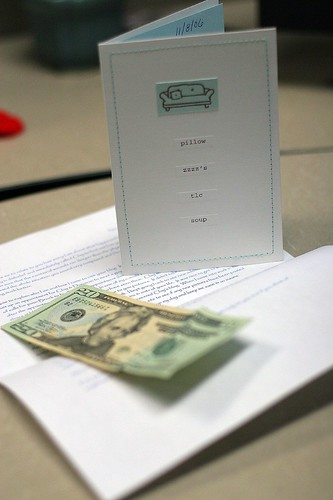

So, for those of you who have been following my blog entries over the last few weeks, you’ll know that I got injured outside of a bar on Sat. November 4th, was hospitalized, and have been slowly recovering since. It’s pretty sad that there are people out there who would do something like that. It seems there’s violence everywhere lately. If you turn on the TV, there’s always some news story about gang violence in Surrey, some beating in downtown Vancouver, some shooting at a nightclub. It never used to be this bad. In the old days you could open your mouth without worrying if someone was going to stab you for it. Now, if you say anything, you really could be putting your life at risk.

If you’re been reading about the PS3 release going on right now in North America, you’ll know there have been [several incidences of violence](http://www.montrosepress.com/articles/2006/11/18/local_news/7.txt) as a result of it. People are shooting each other over Playstation 3s, and that’s sad. And it’s hard when things like that continue to go on to believe that there are really good people out there.

Which I guess brings me to something that happened on Friday. I walked into work, just like any other day. I turned my iPod off, threw my jacket onto my filing cabinet, and sat at my desk. It was then that I noticed a simple envelope with my name on it sitting next to my computer. I had no idea what it was, so I opened it, and pulled the contents out.

  
  
Inside, was a card and a letter. And here’s the story behind it. A nice lady on the east coast of the US somehow read my blog a week or so ago, and found out about what happened to me. This is someone I have never met or talked to before. She then went out of her way to send me a get-well-soon card, and also wrote a nice letter saying she was sorry for what happened to me, and thanking me for doing what I did, even though it turned out bad for me. In addition, she also sent me $20 US, with a note that she hoped I’d go spend it on beer and nachos. And it really made my day, knowing that there are people like that in the world who will go to such lengths to make someone feel better. So, thanks Kimberly — I did hit a bar on Friday night, and I did have both beer and nachos, thanks to you! I’m really glad there are some good people still left in the world.