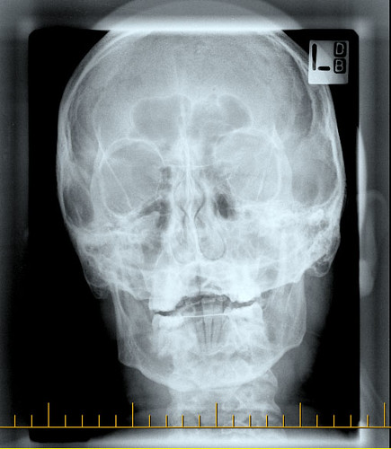
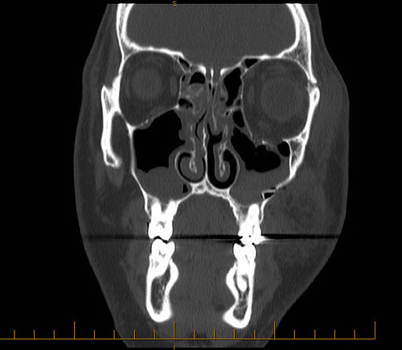

Most of my swelling has finally gone down, which is good. I still have some blood left in my eye, but that’s slowly going away too. Unfortunately, I have three problems left that don’t seem to be subsiding:

- I have a lot of sinus pressure on the left side of my face
- I can’t look upwards without seeing double vision
- My left eye appears slightly sunken compared to my right eye

So, even though my doctor said just to chill out, I decided I’d contact him again today. I had to jump through alot of hoops to get a hold of the same guy who saw me 9 days ago, but I finally got to talk to him. Thankfully, he’s concerned enough that he wants to see me again this week. He’s also going to go over my CT scan again in detail. The first two symptoms are characteristic of what’s called a blowout fracture. Basically, it’s when the paper-thin bone at the bottom of your eye breaks. This causes your eye to sit lower in the socket, and also usually involves muscle getting trapped which restricts upward gaze. I haven’t been diagnosed with this yet, although, as you’ll see in a moment, I bet I do get diagnosed with it soon.

Kate’s fiance does research on orbital trauma, and he knows a really famous plastic surgeon. Thankfully, he offered to take a look at my results and give a second opinion. The only catch is that I needed to get access to my CT scan and my X-rays. I spent some time on the phone today trying to convince people to give them to me, and after a while I finally succeeded. I went down to St. Paul’s hospital today and picked up a CD with all of my imagery on it. I have to say, seeing yourself in such detail is pretty creepy.

Here’s a shot of my face in one of the X-rays they took:

  
  
You might not be able to see here, but on the right side of the image, near the top of my eye socket, there’s a break of the zygomatic bone (the xray is reversed, so that’s actually the left side of my face).

What’s more interesting is a section from the CT scan:

  
  
What seems apparent to me is that there’s a break in the bone under my eye, which totally sucks because that means I would need surgery pretty soon to fix it (if the muscle stays entrapped for too long, it’s really hard to repair it). So, the next few days are going to be interesting.

And by interesting, I mean they could really suck.