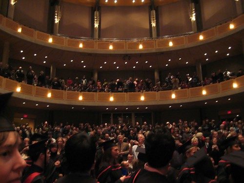

  
  
**Photo of me about to walk on stage (shot by my dad)**  
The ceremony went well, and I officially have my degree now. Gonna go hang it up in my room in a few minutes. I’ll post some more photos that other people took as soon as they send them to me.

  
  
  
  
**My Degree (shot by my dad) — click here to see all his photos**  
My original goal was to do it in 18 months. I did it in 48. Not bad. Not bad at all.