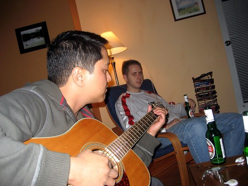
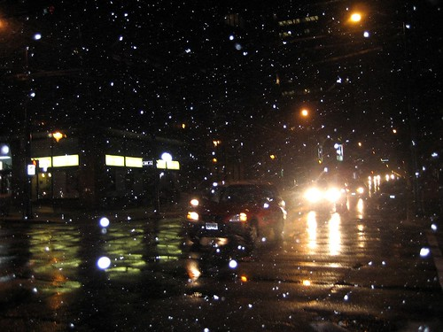

I stuck close to home this weekend, only venturing out briefly to restock my movie pile and grab some food. Friday night, Chris and Cisco popped by to see how I was doing. Later, Tiffany, Katherine and Jenn also came by, and we all just listened to music and hung out.

  
  
**Cisco showing off on the guitar**  
It’s pretty cool that it’s snowing outside. I can’t remember the last time it snowed in Vancouver in November. I really love winter. There’s something about the peace and quiet that goes along with the early nights, the crisp cool air, and of course, the falling of snow.

Seeing it snow motivated me to finally put my Christmas lights back up (now understand, I never really took them down, but I did readjust them slightly when I saw it snowing this weekend). I need to pick up some stuff eventually to decorate my cubicle at work.

  
  
**Snow falling on Davie Street**