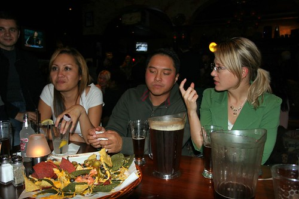

Went out for a few beers last night after work with some friends. We started at Malones on Seymour and Pender, and eventually ended up down at the Atlantic Trap and Gill for a few more. Even Hesty showed up from Singapore or wherever he was.

  
  
**Beer Drinking Snowman at the Trap**  
I had a good time last night, and got to know Kasia and Rob and bit better down at the Trap and Gill.

  
  
**Rob and Kasia**  
I think I’m heading out to Chilliwack this afternoon to do some shopping, visit some family, and maybe watch a movie or two. Nobody out there has seen me since all my stitches have come out, so I think I’ll go show them the new and improved me (which still doesn’t look as good as the old crappy me, but I’m getting there).