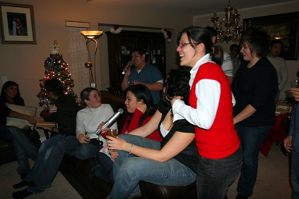
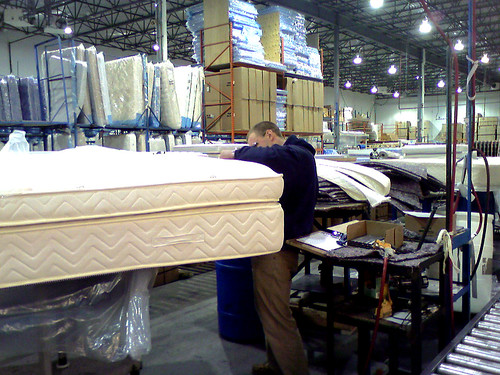

Well, the relaxing period is nearly over. In just a few days, 2006 will be over, and 2007 will ring in with the first work day in over a week for me. I’ve spent the last few days taking it relatively easy.

On Thursday night I went out with Hesty and Neil down to some places in Yaletown. We hit Elixir, and then made a brief stop at Bar None for a few drinks. I’m definitely getting too old for that place.

  
  
**Hesty, struggling to contain his enthusiasm**  
Last night, I went down to Harv’s house for a house party. I was expecting only a few people to be there, but I think there was close to 25 or 30. They also had a karaoke machine set up, which was pretty cool. Ben and I had a few drinks of wine and managed to belt out some Bon Jovi and other great classics.

  
  
**Party at Harv’s House**  
I didn’t get home until around 4am last night, which sucked because Brennen came by at around 8am to spend a day hanging out. I’ve been bugging him for a long time to fix my bed up for me. I’ve always found it a bit hard, and I often wake up with a sore back. So, Brennen finally came out and hauled my bed away. We went down to the Restwell Mattress company in Surrey where Brennen then went to work on adding some foam to my bed. Afterwards, we went back to Brennen’s house and I helped him fix his computer. Brennen has this bad habit of surfing questionable websites at home, which regularly leads to his machine being completely hosed. Everytime I fix that beast, I swear to myself that it’s impossible for a machine to get any worse, but everytime he manages to somehow up the ante a bit and wreck it even worse. This time there was about 200 differently spyware elements on it, task manager was disabled, explorer was deleted, it shutdown randomly, and it was so slow it was nearly useless. I gave up trying to salvage it after 5 or 6 hours, and we finally decided that a complete reinstall was necessary.

  
  
**Brennen pulling my bed apart**  
I’m heading over to Bob’s house for New Year’s tomorrow night, so it should be fun.