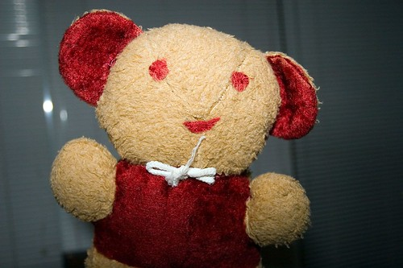

[Clay tagged me the other day](http://twitchy67.wordpress.com/2006/12/26/i-got-tagged/trackback), which means I need to state five things about me that nobody really knows. So here goes.

1. I had a job at K-Mart when I was 17. I’m not sure if my manager didn’t like me, or if some cosmic power was punishing me, but I spent most of my shifts in ladies-wear folding all the panties in the bulk bins. And it’s not like they were some hot thongs or brazillian panties — these were those eggshell-white granny panties. I still wake up screaming in the night thinking of those shifts.
2. I was a bit pudgy in Ottawa years ago. And by pudgy, I mean sort of chunky. After struggling to lose that weight for a long time (gym 5 times a week, 1400 calories a day), I tried the Atkin’s diet basically out of desperation. I didn’t expect it to work at all since it went in the face of everything modern nutrition teaches. I lost 56 lbs in about 6 months and was nearly bone thin when I started eating carbs again. Despite eating “poorly”, my cholesterol dropped over 100 points, and I felt great. From that point on, I started reading medical research myself instead of having someone tell it to me second hand.
3. I got my current job by fluke. I used to almost always work from home during my master’s degree, but one day I just happened to be in the lab checking some emails when the phone rang. It was Erik Lagerway from Xten Networks. He was looking for some guy (let’s call him Joe) so that they could hire him to add video to their current product. Since I didn’t know who “Joe” was, I suggested maybe I could help them out. Two days later I was a full time employee. Last I heard, “Joe” was still unemployed.
4. When I first read the Lord of the Rings books (I think I was like 10 or 12 years old), I put a gold ring on a chain and wore it around my neck for a long time. I’m glad that wasn’t nerdy or anything.
5. When I was first born, my grandma gave me a teddy bear. I had him all through child hood and still have him in my closet. He’s a bit beat up, having been repaired a few times, but he’s still pretty cool. I’ve lent him out on a few occasions to cheer some people up — once to my grandma when she was recovering from surgery a few years ago, and once to my neice when she was sad. I plan to give him to my own kid someday.

  
  
Ok, so now apparently I have to tag five more people. This means you have to do this same drill. So, dad, Dustin, Dori, Hesty and Chris — you guys are up. Oh, and please don’t trash talk Teddy in the comments — he’s pretty sensitive.