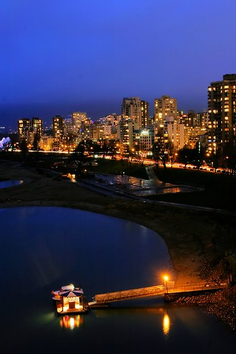

I went out tonight and shot a few photos around town. I wanted to try my hand at [making a HDR image](http://en.wikipedia.org/wiki/High_dynamic_range_imaging). Here’s one of the better ones off the Burrard Street Bridge.

  
  
Here’s one more in roughly the same location.

  
  
**HDR from the Burrard Bridge**