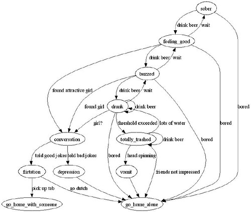

I had the need to make a few state machines today, and grew tired of doing them on paper. Derek pointed me towards [GraphViz](http://www.graphviz.org), which is a graphics package capable of doing finite state machine diagrams. All you need to do is generate a simple text file that outlines the state transitions, and their “dot” program will output the state machine diagram for you. Pretty nifty.

Here’s a simple example I did:

  
