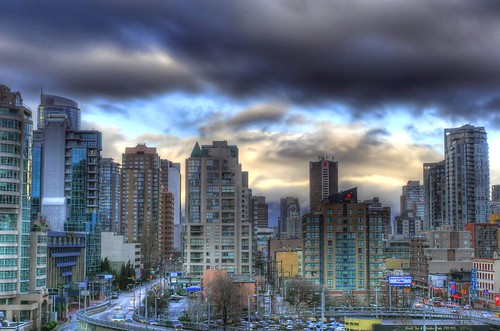

It’s crazy windy outside, and it’s been cloudy and yucky for most of the afternoon. I’ve been listening to the wind howl from my couch.

I took a quick break to snap some shots off my patio of the storm. One of them was used [in this news story online](http://www.nowpublic.com/wind_earthquake_rattles_british_columbia). Here’s another shot I took as the clouds were breaking.

  
  
On another note, I figured out how to play In Repair by John Mayer on the guitar tonight.. My fingers are pretty small for it on the acoustic, but I can manage on my electric. Which makes me realize how badly I want a new guitar now.