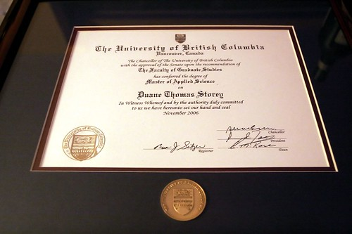

So the day before I went into surgery in November, I walked across the stage a second time at UBC. This time, I was picking up my master’s degree in Electrical and Computer Engineering. It took me four years of part time work, and it was a real struggle, so walking across the stage finally was a big relief — I was so happy it was finally over. I had an eye exam about an hour before the ceremony, and they were forced to dilate my eyes for some of the tests. So after four years, I couldn’t even really see the ceremony I had waited to attend. I had to get someone to help me find my place in line since I couldn’t read any of the paper work, and I basically had to follow the blob ahead of me and hope they were leading me in the right direction.

When I got home that night, I sort of plopped my degree in the corner of my room and went to sleep so I could wake up and head to St. Paul’s for 8am. I basically forgot that it was on the floor in my room for the last few months until my dad mentioned to me today that I really should hang it up. Since I was at UBC already, my dad offered to pay for a frame from the bookstore so I could finally put it up on my wall and get it off the floor.

So, after more than two months, here it is, finally framed.

  
