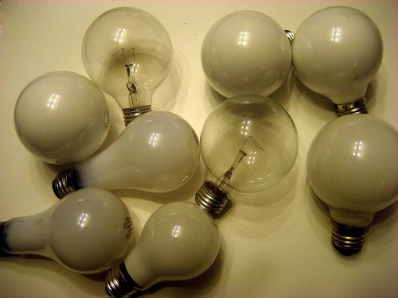

Well, yesterday [I posted my CFL challenge update](http://www.migratorynerd.com/archives/264). So far, I only have verbal commitments from people to change a few lightbulbs this weekend and contribute some photos. But hopefully they all pull through.

As for me — I stopped at London Drugs on the way home and bought 6 CFL lightbulbs. Surprisingly, those 6 allowed me to replace 9 normal ones in my place (since the new CFL ones are way brighter in my bathroom — so bright that I don’t need all the lights I had in there).

  
  
Here’s a summary of what that did:

- Power removed from incandescent bulbs: (7x40W + 2x70W) = 420W
- Power added from new bulbs (4x11W + 2x27W) = 98W
- Net power savings: 322W

Now, if you browse through the internet, you can find find out that 1 kWh of electricity produces 1.6 pounds of carbon dioxide. Assuming I use the bathroom lights for an hour a day (showering, bathroom breaks, etc.) my living room for two hours a night, and my bedroom for one hour, that means I’m saving about 0.43 kWh worth of electricity per day. Multiply that by 365 days and 1.6 lbs of CO2 per kWh gives me my final savings: 155 lbs of CO2 per year. Not bad for a days work.

I have about four more lights I can replace before I’m done in my place. I’ll try and do it before the weekend is out.