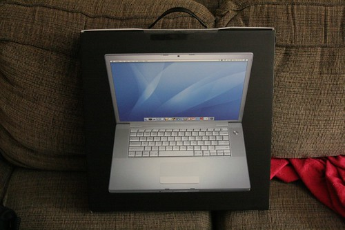

Most of you that know me have undoubtedly seem me cursing at my computer furiously this past week or punching my laptop from time to time. The reason for this sudden change in behaviour stems from my recent installation of Windows Vista. Somehow, that whole process turned a pretty decent laptop into something completely unusable.

So today, while trying to edit some photos at Northern Voice, I realized that I just couldn’t go on using my laptop the way it was. Everything was really slow and most applications crashed from time to time (especially Photoshop). Since I’m about to leave on vacation, and I really need a laptop to take with me, I debated spending the first day of my vacation reinstalling XP on my laptop. Which would obviously suck, but something really needed to be done.

And then, looking around at my peers in the Forest Sciences Center at UBC, I found the answer in the shape of a glowing white Apple. So, after I dropped Kasia off at home, I stopped off at Future Shop and picked up a shiny new MacBook Pro. It took me about ten minutes to get up and running, and I just finished uploading a few photos to Flickr with it.

It’s unfortunate that Microsoft spent five years working on a product that really isn’t that impressive, at least in my eyes. But thankfully, their product finally inspired me to do what I’ve wanted to do for a few years now — rush out and buy a Mac.

Thanks Windows, for all the memories.

