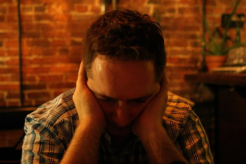

So, there are a million things I could say about this week, but I’m just too tired.. It’s been long, and I have to get on a plane in less than 24 hours to head to Europe.. It’s nearly 15 hours of travelling, and when I get there it will be cold and snowing.

I went out with Derek and Cisco for a few hours tonight, despite being completely bagged. We ended up at Salt in gastown (which is a really wicked wine tasting place). Here’s a shot of me tonight.

  
  
And here are a few more from the night. Special thanks to Van for lending me his 24-70 f/2.8L for the week in Europe.