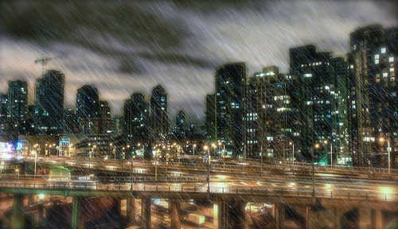

I’ve been messing around a bit more with photoshop in the evenings, and one day soon I’ll read the huge 1000 page book I have on it as well. Here’s something I was messing with a bit last night. It’s a shot from my patio looking easy towards Yaletown. The bridge is the Granville Street Bridge.

  
  
The whole image involved work on about 5 different layers in photoshop. The rain was a bit trickier than I imagined, and it’s not entirely convincing, but it’s a good start.