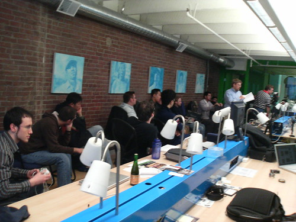

Tonight I found myself down in the gastown area, having a few beers with old pal [Boris Mann](http://www.bmannconsulting.com) down at the [Bryght](http://www.bryght.com) offices. He was nice enough to invite me to some of the Thursday night BBQ lovin at his offices, and introduced me to the ever-sought-after “Save On Meat” store around the corner from the offices.

  
  
**Photo by Roland Tanglao**Afterwards, I stuck around and hung out for the [Drupal](http://en.wikipedia.org/wiki/Drupal) monthly Vancouver meetup and learned both about Drupal 6.0 and some of the Install Profile work that the guys at Bryght have contributed back. I’m in the process of setting up a new website with a different focus than this one, and I’m debating using Drupal as the core technology instead of WordPress. Boris suggested I swing by tonight for some cheap-meat marinated in Drupal.

One of the more interesting things I overheard during the evening was everyone’s recent experience with a conference that Yahoo helped accomodate down in Sunnyvale, California. Apparently entering into the US was such a pain in the ass for some of the participants (namely Europeans) that they are actually considering not having any more of these open source conferences in the United States. And while the end result of the new security measures implemented after September 11th, 2001 is to somehow improve security in the United States, it’s a bit worrisome that a side effect of these changes is a reduction in conferences meant to share information. I can’t help but worry that this sort of mentality will grow, not only for open source conferences, but also for crucial academic conferences as well.