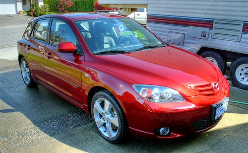
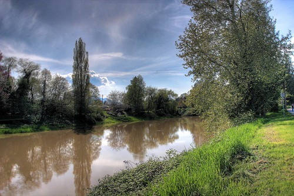

Last night we had a mini drinking event at work where we said goodbye to Chris and Hanh. After consuming a few beers, we sat down and started to watch a bit of the hockey game. After the second period, Hesty and I ventured down Robson street on our way home and met up with [John](http://www.audihertz.net/blog/) and [Rebecca](http://www.miss604.com) for a drink at a local restaurant.

This morning I woke up around 11am (and man, was it nice to sleep in), had a quick shower and hopped into the car headed for [Chilliwack](http://www.flickr.com/photos/duanestorey/476151538/). It seems like it’s been a really long time since I’ve been back home.

  
  
My dad and I went halfers on some homemade wine a while ago, and today we got to head down and bottle it all up. So I now have 15 bottles of some really tasty Syrah to consume, in addition to the 20 or so bottles I already have at home of primarily pinots. After running a few errands, my dad helped me wash my car (which I haven’t really had time to do for months now). I just got back from lounging around on the patio in the sun, and I’m going to lay down and take a nice nap.

It’s really nice to get out of the city and back to where I grew up. I think I’m going to just relax at my dad’s house tonight and then spend tomorrow visiting my mom and my niece and nephew. I’ll be back in the city late tomorrow probably.

  
