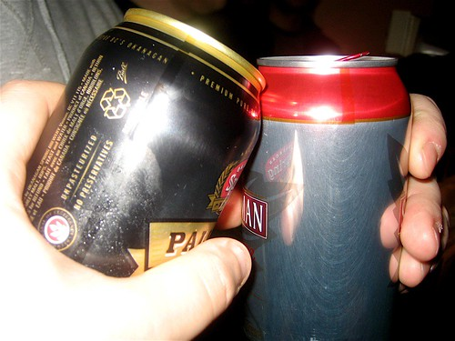

When I left Ottawa years ago, I was a pretty chubby guy. Two years of working crazy hours, drinking tons of beer, and eating primarily in restaurants had taken its toll, and my old university self had been replaced with your stereotypical software engineering stature. As soon as I got settled in Vancouver and started classes again at UBC, I decided to undo all the damage of my Ottawa experience — I started watching what I ate, getting a bit more exercise (mostly by rollerblading and hiking), and even sleeping in a bit more. In about six months, I had dropped 40 lbs, and ended up being substantially lighter than I was in university. I would even say that when I started working at my current job I was a bit underweight for my frame.

  
  
That being said, ever since my last break up, and with everything that happened in the last year (hospitals, surgery, etc), I haven’t really kept up with the requirements of staying in shape. I told myself as soon as my next surgery is over, I was going to once again remedy the situation. Unfortunately, the surgery that should have happened in March keeps getting delayed and at the soonest, looks to be occurring at the end of May or early June now. So, I’m not going to wait around for it to happen.

Sunday night I finally told myself it was time to start, and get back down to my pre-last-failed-relationship weight. I was a bit scared to step on the scale since I haven’t been on one in about four months (even though I have one sitting in my bathroom), but I took a deep breath and waited for the LED display to light up (in my head I heard Garfield’s scale saying “one at a time please”) Thankfully, the number I expected was about 10 lbs heavier than the number that showed up, so things aren’t as dismal as I thought.

So, my current goal is to drop twenty pounds. I figure if I eat at home more, hit the gym a bit more, and scale back alcohol consumption, things should go rather smoothly. I’m sure I’ll post some nerdy graph at some point to keep myself motivated and inspire all the other computer-potatoes, so stay tuned.