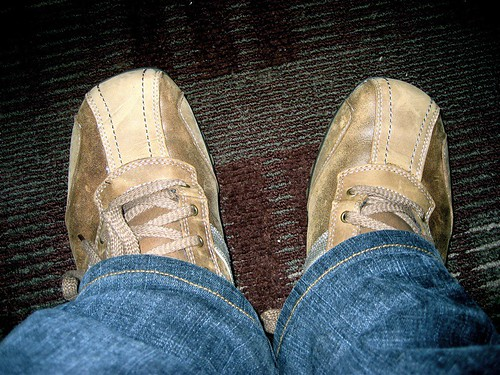

First, I just want to say how bad Aldo shoes suck. I’ve blogged about that fact before I’m sure, but now as I am about to throw away a $110 pair of Aldo shoes that didn’t last six months, I am suddenly reminded of it. After the first two months, one of the soles came off. I told the guys at the store, and they just assumed I was way too hard on my shoes. So, I coughed up some cash and had the shoes fixed by a shoe-fixer guy. Two months later, same deal, except on the other side. So, I coughed up some more cash and had another shoe repair person fix the second one. Jump forward two months, and the shoes are just falling apart. So, they are going in the trash. If I ever suggest buying Aldo shoes again, please hit me very hard.

The other shoes I am about to throw out actually weren’t that bad an investment. I originally picked them up in the Shibuya district of Toyko when I was there, and they actually served me quite well. However, the soles are falling apart, and they fill with water quite easily now. Besides that, they have like no support left inside, so my feet get really sore.

  
  
So today at lunch I went for a quick walk and picked up a new pair of shoes, and they are both purdy and comfy.

Tomorrow everyone in the office is boarding a bus for Whistler to spend the day hanging out and relaxing. Some people will be snowboarding, some will be Ziptrekking, some will be golfing, and a group of about 15 people, including me, will be bouncing around the mountain relaxing. As part of the event, I get a free pass to ride the Gondola, and unlimited access to the Fairmont Chateau Whistler’s spa and gym (including their huge, heated outdoor pool, complete with underwater music, three outdoor whirlpools, saunas, two eucalyptus steam rooms, a fitness center, and a massage parlour).

I’ll be taking pretty much all of my camera gear (which should be interesting, since I rarely bring it all out). I’m hoping to come back with a whack of shots from the day, and even some from the drinking festivities at the end of the evening.