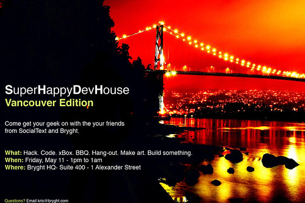

  
[  
  
Photo by ](http://www.flickr.com/photos/kk/490198495/)[Kris Krug](http://www.flickr.com/photos/kk)  
  
Starting at 1pm this afternoon, a group of internet enthusiasts will be gathering down at the [Bryght](http://www.bryght.com) offices for some food, drinks, Nintendo Wii and lots of fun. It’s going to be a chance to mingle with like-minded people, enjoy some music, and even catch up on whatever internet-related project you currently have on the go.

I’ll be meeting up later tonight with [Kris](http://www.kriskrug.com), [Kim](http://www.discollection.ca), [Boris](http://www.bmannconsulting.com), [Rebecca](http://www.miss604.com), [John](http://www.audihertz.net/blog/), and a whack of other people I haven’t met yet. I think Kim even challenged me to a drinking contest, something I’m sure she’ll regret tomorrow.