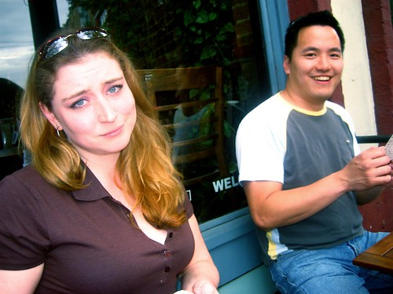
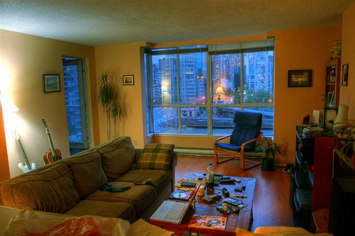

On Friday, I met up briefly with [Rebecca](http://www.miss604.com) down at the [Six Acres](http://www.dinehere.ca/restaurant.asp?r=2149) in Gastown for a few drinks on a patio. It was a good way to start a Friday afternoon, and since I had only woken up a few hours prior, I was definitely in the mood to drink and grab something to eat. Afterwards, we went down to the west-end for some pizza, and to hang out with [John](http://www.audihertz.net/blog), who was busy playing with Dave Olsen’s new microphone on his computer.

A bunch of my new blogger-type friends (most of which I originally ran into down at Northern Voice) were down at DemoCamp the other day, but unfortunately I wasn’t feeling up to venturing out of the house, so I stayed home and checked out [Rebecca’s live blog of the event](http://www.miss604.com/2007/05/democamp-vancouver-liveblog.html). Apparently for short notice, there was great interest and turn-out.

  
  
Rebecca, obviously excited I’m taking her photo  
Last night I completely overhauled my apartment. I’ve been living in it a few years now, and I’ve never really found it very comfortable. So last night, I decided to spend some time moving stuff around (which also gave me an excuse to do a deep clean of my living room, finally getting at that stuff that always ends up under the couch).

[  
  
  
  ](http://www.flickr.com/photos/duanestorey/515550944/in/photostream/)

So far, I’m really loving the new layout. I woke up this morning, and was suprised how much brighter and cozier it looks. I think I might go out today and buy a few small things (like a proper TV stand, or a little corner table), but I really have no idea where one would go in Vancouver to buy something like that. Ikea maybe? Or a proper furniture store?

Anyways, tomorrow is my first real full day back at work. I’ve been working off and on during the week, but I’ll head into the office tomorrow and wind back into the daily grind. In terms of the surgery, I think the jury is still out on the success of it or not. I really need to wait it out a month or so before I comment. The double vision seems a bit better, and it is supposed to slowly improve over time. In terms of the position, it’s definitely better. It’s not perfect, but once the swelling goes down on my cheek, I doubt anyone other than me would be able to tell the difference. The scar seems to be healing better than I thought based on a week ago. I really thought it was going to be ugly and unsightly, but it’s slowly returning to nothing more than a small line under my eye, which should slowly fill in over the next six months.

I’ve also been working on a few side projects this week in between sleeping sessions. I’m hoping to blog about them soon.