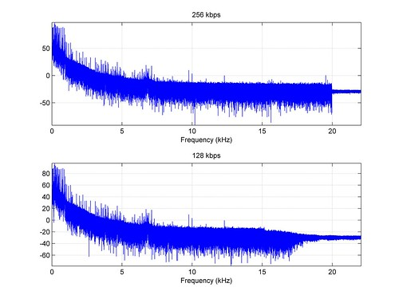

Yesterday Apple released [verison 7.2 of iTunes](http://db.tidbits.com/article/9016) which finally gives users the ability to download DRM free versions of songs from iTunes. The added bonus is that you can also download 256 kbps AAC versions of the files instead of the 128 kbps AAC versions.

So, before I actually go into the experience, I’d have to say I was slightly hesitant about this. When people think 128kbps, they automatically think of the old MP3s. And at 128kbps, MP3 files are fairly close to CD quality (for most people), but on my stereo at least, I can notice slight distortions. However, AAC is part of the MPEG4 standard (used in IPTV and some of the HD DVD specifications), which is a big improvement over MP3. While it varies based on the material, MP3s at 128kbps sound similar to AAC files at around 96kbps due to improvements in the underlying technology.

So, my point is that 128kbps AAC files should sound pretty good for most people.

The first thing I should point out is that iTunes fires up after the upgrade in normal, full-on DRM mode. There’s a button near the top that will enable the DRM-free mode, which will convert all the prices on in the iTunes stores to the DRM-free versions, if they exist from the band.

So, after clicking that button, iTunes informs me that out of the 215 songs in my library that were purchased, and thus protected by DRM, only 13 of them (which represents the entire [Air – Pocket Symphony](http://en.wikipedia.org/wiki/Pocket_Symphony) album) can be converted to DRM-free versions. So, I figured, what the hell — might as well let the healing begin.

After typing in my iTunes password, I sat back, waiting patiently for the downloads to start, and my musical experience to be taken to the next level. Unfortunately, this is what I got:

  
  
Hmm.. That’s not so good. I messed around for nearly 30 minutes before it actually managed to download a full DRM-free version, and as of this blog post, 11 songs are still in an error state, waiting for some magical, celestial event to occur before they start. Thankfully, you get the option of backing up the DRM versions on your hard drive during this process.

Since I now had both versions, I figured I might as well see if the DRM-free versions \*were\* actually better. I did a quick listen, and I couldn’t really hear a difference. So, I burned both versions to a CD, then ripped them back into my hard-drive as PCM Wave files, fired up Matlab and then switched my brain into DSP mode, a place I don’t visit very often anymore.

I did a quick and dirty [Fourier transform](http://en.wikipedia.org/wiki/Fourier_transform) to figure out what the spectral properties of both files looked like. Here’s the result:

  
  
They look pretty similar up until around 16kHz (which is where most voice frequencies start to diminish sharply), at which point the high frequencies start to roll off fairly quickly in the 128kbps version. In the 256kbps version though, the highs are maintained up until 20kHz, at which point there’s obviously a deliberate cut-off filter in-place (probably to avoid any aliasing during the conversion to 44.1kHz/CD).

So, without a doubt there are extra high-frequencies in the 256kbps, which means you are actually getting more for your money (at least, you are getting more highs, so if you like more highs, then you’ll be happy).

I tried moving the DRM-free file to another computer and using it there and had no problem whatsoever. So Apple lives up to their promise in this area.

In terms of whether or not this actually makes a difference, I’m not too sure. It’s 1:30am here and I live in an apartment, so I won’t be able to crank my stereo until tomorrow. But for those of you who want to take a quick listen, here’s a small segment of Air’s Night Slight.

1. [Encoded using 128kbps DRM](http://www.migratorynerd.com/data/128kbps.wav)
2. [Encoded using 256kbps DRM-Free](http://www.migratorynerd.com/data/256kbps.wav)

If anyone has a problem with me putting 15 seconds worth of a song up here, let me know and I’ll take them down. But I think it’s an important comparison to make, considering tons of people are going to start converting their whole libraries based on the assumption that it’s going to improve the music quality (and since Air was the only band in my collection that had DRM-free, 256kbps versions available, they were chosen — however, you should check them out yourselves).

So my personal feelings are this:

a) Apple still has a few bugs in the delivery system for DRM-free music  
b) EMI is the only label on board right now, and they happen to be the smallest one \[[thanks to Boris Mann for correcting this](http:/www.bmannconsulting.com)\]  
c) 128kbps and 256kbps files sound nearly identical

So, before blowing a pile of money on upgrading to DRM-free versions, I’d recommend actually taking the time to figure out if you really need to, or would notice a difference anyway.

\*\* The song used for the graphs was Air’s Night Slight, chosen partially because it contained a lot of high frequencies, and partially because it was one of two DRM-free songs that iTunes actually managed to download.