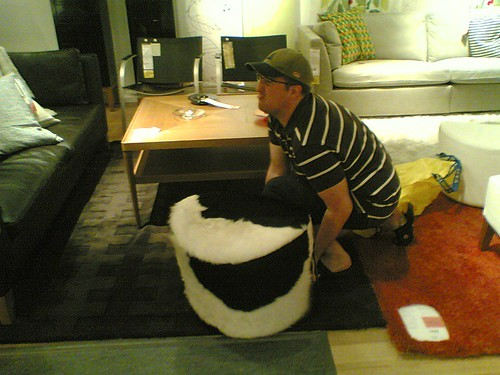
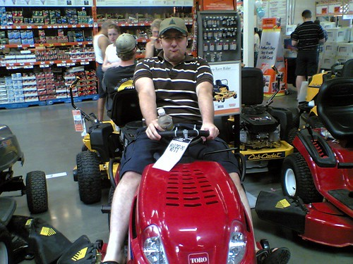

Jesus.. My apartment wasn’t made to survive the summer.. It’s currently 26C inside, and I’m sweating to death despite having all my windows and patio door open.

I made the big mistake on Friday night of heading down to [Bryght](http://www.bryght.com) for a little party, and ending up drinking myself into a coma. I didn’t wake up until around 3pm the next day, which is surprising considering how hot it was inside.. I guess all one can really do in this heat is crack a few beers, kick your feet up, blare some music and take it all in stride..

Last night at around midnight, while in the middle of watching a pretty cool movie, the power went off in the building. As the last of the gadgets in my living room stopped beeping and whirring, I suddenly remembered a memo I received under my door a few days prior about a scheduled power outage this weekend. Oops.

I spent the next hour or so frantically trying to hack WEP keys for other wireless connections in buildings nearby, but was unsuccessful. I even tried to get my cell phone working with my Mac so I could use the EVDO to do a few things on the internet, but that was a complete bust too. So, I lit a few candles, played in Garageband, and just took it easy until the LCD on my laptop eventually flickered out and died, the battery finally drained.

Today I gathered up [John](http://www.audihertz.net/blog) and [Rebecca](http://www.miss604.com) and headed down to Ikea in Richmond for some shopping. It was a fun trip, even though I didn’t buy too many things. Some asshole honked at me in a situation where he shouldn’t really have, so I spent the rest of the trip honking at everyone else in retaliation. While at Ikea, I demonstrated my genetic Cow-Tipping ability on something that closely resembled a cow. As I told them, you really need to put your legs and back into the cow-tip, or it doesn’t work.

  
  
Photo by [miss604](http://www.miss604.com)  
Afterwards, I showed everyone in Home Depot just how you’re supposed to ride a tractor or a lawnmower. The trick is to pucker your lips and make tractor sounds while you drive it.

  
  
Photo by [miss604](http://www.miss604.com)  
A fun day, and I still have seven hours of it left. I’m going to finish a few Heineken’s here, then show everyone on a patio somewhere just how Chilliwack boys drink beer in the sunshine.

Maybe I’ll even run into some cute beer-drinking, tractor sound-making cow-girl who wants to hop on my tractor and ride with me, past the tipped-cow, into the sunset.