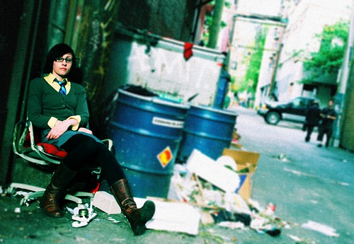

So, I gotta hand it to my pal Kris — he’s managed to get me interested in something I never thought I’d be interested in again — film photography. [Kris is a really awesome fashion photographer](http://www.staticphotography.com) here in Vancouver, and his stuff never ceases to amaze me.

What’s interesting about Kris, and a variety of the local photographers I’ve met recently, is that they have started shooting film again. Which is sort of surprising, given the focus local photography shops seem to place on digital nowadays (I called several local stores recently to talk about film, and most of them didn’t even have film cameras in stock anymore).

So, since I’m intrigued by this, I’ve been in the market for a cheap film SLR that will be able to utilize all the current lenses I have in my kit. Since most of my lenses are pretty decent now, and the body is arguably not that important (as long as you know what you are doing), I think I can get away with something rather inexpensive. To that end, I found a rather good deal here in Vancouver for a guy that’s looking to make a quick buck and get rid of the film SLR collecting dust on his shelf, for the low price of around $125.

There happens to be a certain look and feel that you get with film that most digital mediums just haven’t been able to replicate. Despite the technological success that George Lucas made by shooting Episode III in full digital, almost every modern film production still uses film (even though it’s far more expensive than shooting digitally). Some of that is probably a comfort factor with film, but perhaps some of it is simply because the look and feel of film is what we’re accustomed to.

While I definitely want to play around with a film camera, I also have a few other reasons for wanting to have a second body around. First, I have a wedding to shoot in October, and I want a second body around in case mine were to suddenly die on the spot. While shooting a good portion of the wedding in film is a rather scary notion for me (mainly because I’m going to be stressed out enough), I would rather shoot some of it in film (if I had to) then lose those moments forever. Assuming I can get comfortable with the film body before the wedding, then it will be my backup, otherwise I’ll be forced to rent a 30D or a 5D for the day.

Having a film body will also give me back the proper focal length range on my camera. My EOS 20D has a crop factor of 1.6, which basically means all images that hit the CMOS are effectively cropped, causing a multiplication factor of 1.6 to be applied to each focal length. For example, my 17-40mm wideangle lens acts like a 27-66mm lens, which just isn’t as exciting. So, I might just keep my wideangle on the film body at the wedding for the serious drama shots.

The last reason that I’d like to play with film again is because Kris has got me interested in the area of [cross processing](http://en.wikipedia.org/wiki/Cross_processing). To read more about it, check out [Kris’ post](http://www.staticphotography.com/photography/cross-processing-slide-film) on Static Photography.

So, hopefully this Friday I’ll have the first film SLR body I’ve ever owned. It’s the [EOS Elan-7 model by Canon](http://www.steves-digicams.com/2001_reviews/elan7.html), and as I mentioned, should work flawlessly with every lens in my kit. I’ll play around with shooting some stuff via film again to see what the results are.

I also managed to find a [set of Photoshop actions that simulate cross-processing effects](http://www.adobe.com/cfusion/exchange/index.cfm?event=extensionDetail&extid=1045139) on Adobe’s website. Here’s a shot I took at the Gastown Photowalk last week, but put through a series of cross processing effects in photoshop:

  
  
And another shot of my friend Rebecca:

  
  
The action set has ten different varieties of cross-processing, only one of which is shown here.