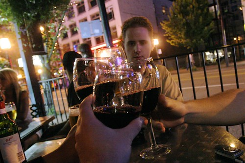

Last night I went down to Malone’s on Seymour street for a few after-work drinks with Kasia, Chris and Cisco. Afterwards, we decided to make our way down Granville (which eventually brings me home) and stopped by the Granville room for a bottle of wine. I ran into my old friend Brigitte and some of her friends which was a nice surprise. Unfortunately, I drank more than I should have, and had a nice headache most of the day.

  
  
Tomorrow I’m going to head into work for a bit and catch up on a few things, and then Sunday I’m heading out to Chilliwack to hang out with my family for father’s day. I’m in the process of finalizing some travel arrangements shortly for hopefully a quick weekend getaway to San Francisco to see some friends. My plate is really filling up this summer, and I really need to take some time out to put it all into Google calendar so I don’t miss out on some of it. I also have a few friends down in Seattle that are going to come up soon and check out Vancouver.