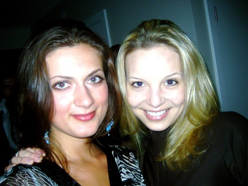

Last night, a few of us gathered down at Ben’s house near the Crosstown area for a small housewarming party. Ben is a good friend of mine from the old UBC days, and he’s pretty close to being a full-fledged doctor now. Afterwards, a small group of us briefly ended up at Honey for a round of booty-shaking.

  
  
Me and Joe, @ Honey Lounge  
I also got to meet a few new people through Ben, which is always something I rather enjoy. Here’s a shot of Delilah (from Toronto) and her Vancouver friend Kate. Delilah has offered to show me around a bit when I’m in Toronto in August, and I’m quite looking forward to it (since I’ve never really enjoyed Toronto that much).

  
  
Delilah and Kate  
It’s always great hooking up with my old UBC friends — we never seem to get together enough these days.