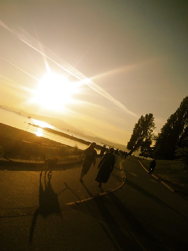

That’s right. Yours truly finally got his butt off the couch long enough to go outside and get some exercise. I’m happy to report that I managed to rollerblade at a pretty good clip for a whole half-hour without puking or anything. I guess you could say this officially kicks off my getting-in-shape thing (please don’t search the archives for the last time I said this).

  
  
I’m going to be attending a pool party in Las Vegas next Friday, and I’m hoping that with enough effort I can lose twenty pounds by then and look absolutely smokin’ with my shirt off.

A guy can dream, can’t he?