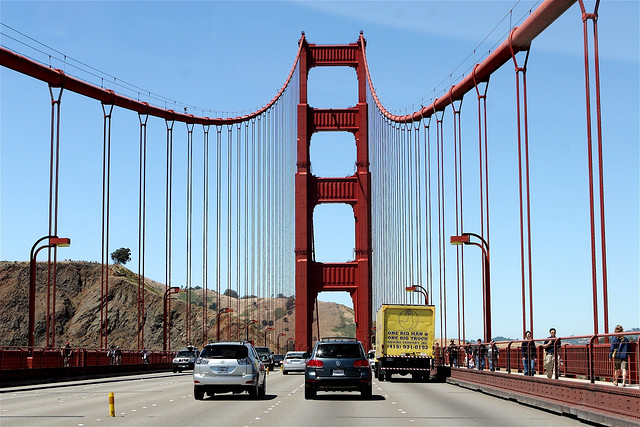
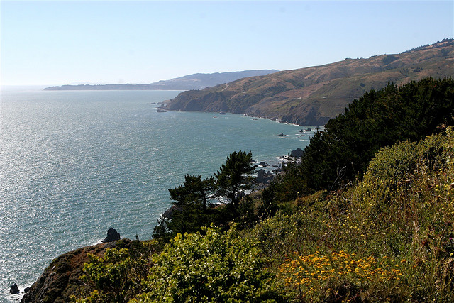

After leaving Las Vegas, I ended up in San Francisco yesterday. I spent a good part of yesterday just driving around with Jason taking photos, and soaking up some of the beautiful California weather. Normally San Francisco is rather chilly in the summer time due to the fog that blankets most of the city. However, the last few days it has been really nice here – sunny with a nice breeze.

I walked into Safeway down here last night to get some wine. On my way out, I saw some weird type of diet coke. Upon picking it up, I nearly fell over when I saw what it was. They call it Diet Coke Plus, and it’s like Diet Coke except they have added vitamins and minerals to it. Pretty soon you won’t even have to eat normal food anymore.

Today Jason and I drove across the Golden Gate bridge and checked out [Marin County](http://en.wikipedia.org/wiki/Marin_County,_California) as well as the [Muir Woods](http://en.wikipedia.org/wiki/Muir_Woods). It was a really nice day just chilling outside and enjoying the weather. I was originally going to head back to Vancouver tomorrow for Canada Day, but I changed my flight around and will probably be here until Thursday. I have my laptop and hand held devices with me here, so I can just work down here for the next two days. I’m going to to be working tomorrow, and taking July 4th off for celebrations down here. I don’t think I’ve ever been in a large city in the USA before for July 4th, so hopefully there are some cool celebrations to check out.