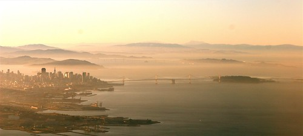

So, this is the first blog entry I’ve written in quite some time while disconnected from the internet. I’m about 30 minutes out of San Francisco, somewhere around 40,000 feet. I feel like complete shit, and I’m really glad I decided to head back today instead of risking being down south and getting even sicker. A few minutes ago I had my head in my lap in pretty much unbearable pain — turns out my right ear had some real problems adjusting to the change in pressure in the airplane, probably since I’m so congested right now. If I don’t see some major changes in how I feel by tomorrow, I’m heading to the first clinic around my place before I end up in the hospital with pneumonia.

  
  
Before I left tonight, I went through the blog entries I’ve written over the last few months and realized that most of them were pretty much complete garbage. Truth is, I haven’t really been in the mood to write lately. Or rather, I just haven’t had any significant to write about. I was out drinking with a few friends a while ago, and one of them told me they had basically stopped reading my blog because it was too depressing. And to be honest, that kind of bothered me — while I’ve definitely written about a few things that have bothered me over the last six months, and have used my blog to express some personal frustrations I’ve had, I don’t think it’s all dark and gloomy over here. If my writting gets a little depressing, I always try to balance it with some heart-felt hopeful photographs.

Leaving San Francisco tonight was a bit weird for me. The last time I had walked through San Francisco airport on my way back to Vancouver, I had done it with the knowledge that it would be the last trip my ex-girlfriend and I took together. We had been fighting all that weekend, and I think we both knew in our hearts that it was done. That trip was actually a last ditch effort to save it, and I purchased her a plane ticket to join me in California for a few days of hanging out together on the Monterey Coast. I couldn’t tell you where it happened exactly, but somewhere between San Francisco and Vancouver that evening, we both called it quits. When she dropped me off at home later than evening and said goodbye, I knew that after two years, it was finally over.

So as I walked down the escalator from the AirTram in SFO tonight, past the bench where we sat and talked for a while that night, past the stairway where I helped her carry her bag, I was reminded about the finality of some things in life. I’m thankful we are still friends, but sometimes I still struggle to understand how, from where we began, did we end up where we did.

And that’s life I guess, and truth be told, I don’t have any hard feelings. That trip was a long time ago now, and for the most part I don’t really think too often on things past. I’ve never met her current boyfriend, but she seems happy enough, and I’m happy for her. I know he doesn’t treat her as well as she deserves, and I have done my best to fix that for her, but ultimately she needs to realize her own self worth and make her own decisions.

In terms of dating, I think it’s fair to say that I haven’t really gotten back on the saddle yet. I went through the typical post-relationship rebounds after my last one was all done, but eventually realized just how empty they were and gave up. These days, I really can’t be bothered to try and meet women at pubs anymore, so perhaps it’s time to start whoring myself out on lavalife again.

Truth be told, I actually met my last girlfriend on Lavalife, and met a lot of people through there that I still keep in touch with. My tagline on my profile way back then was “Free Nachos, Enquire Within” something that got the attention of a lot of women surprisingly. I do make a pretty mean plate of nachos, as I’m sure most of my friends with attest to, so maybe it’s time to try that angle again. First things first though — I really have to get back in shape. It’s been bothering me for so long now, and I really need to make it a priority. To that end, I’m going to spend tomorrow at home refactoring the things in my life to make that happen. I’m going to stop eating out, which means that I need to actually get groceries and keep my fridge stocked. I need to start biking to work or something, so that I can reclaim that hour I spend walking each day. I’ll probably start running again too if I can somehow force myself to get up in the mornings. And in terms of waking up, I really have to scale back the caffeine consumption. I’m pretty sure my problems sleeping are linked pretty closely to my intake of caffeine.

I once lost a lot of weight, so losing it again doesn’t really scare me. But it does take some personal dedication, especially in the area of alcohol consumption — I’ve basically found it impossible to lose any weight if I do any amount of drinking during the weeks. I’ve tried switching to wine and rum and diet coke, which are both relatively low-calories, but that hasn’t really made too big an impact. So perhaps I really need to go cold turkey for a while.

In terms of exercise, if anyone wants to go for the odd run, rollerblade, do the Grouse Grind, or whack a tennis ball around, just drop me a line. Maybe we can start a seawall running club for people who really weren’t built to run. We can make our own t-shirts and everything.