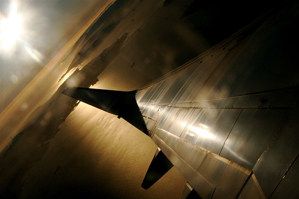

I’ve been meaning to write a post like this for a long time, so here goes. I’ve been into digital photography for around seven years now, but I would only really say I have taken it seriously since acquiring my digital SLR approximately three years ago. Years ago I would say digital photography is a hobby of mine, today I would say that it’s my passion.

  
  
Truth is, I love taking photos. I love the challenge associated with finding a subject, figuring out how to best represent that subject, framing the subject, and then ultimately spending time on my computer later re-factoring the shot or enhancing certain elements of it. To me, the whole process is exciting, and I don’t really place any emphasis on any parts. In some ways it’s like golf – you have your short game, your long game, your putting, etc, but if you want to win any tournaments, you need to be proficient at all of them. And I’ve slowly been improving all the areas where I feel I’m still weak in.

I know some local photographers who absolutely refuse to photoshop any of their photos. And while I respect their stance, and support it to some degree, I have had relatively bad photos turn out rather nice after a bit of tweaking in photoshop. My only reason for not embracing photoshop more is that ultimately, I’m interested in photography, and I feel if I massage the photo too much in photoshop, it’s really not a photo anymore. Granted, it’s still art, and it’s still worthwhile, but it’s just not what I’m interested in right now.

If you were to ask me what the one thing was this year in photography that I really felt like I made strides on, it would be, without a doubt, composition. Composition is basically the broad term that refers to placing a subject within a camera frame. Every camera format has its own challenges, but there are some basics that every photographers learns at some point.

  
  
If you are new to photography, and are looking to improve your photos drastically, then you need to read up on [the rule of thirds](http://en.wikipedia.org/wiki/Rule_of_thirds). Basically, if you’re struggling to compose a shot, draw a mental tic-tac-toe sign on the frame and place your subject at one of the four crossing points (or along one of the lines). That’s it. If you are taking a photo of a sunset, place the horizon along the top line or the bottom line, but rarely in the middle. Which one do you choose? Well, if the sky is interesting, then show more of it, if the ground is more interesting, then show that.

If you’re taking an action shot, make sure you give that action somewhere to go. For example, if you’re shooting a person running down the beach place them along the line that gives them somewhere to run.

The reason I’m writing about composition is that I’m finally at the point where I’m comfortable throwing the rule of thirds out the window. That’s not to say that I don’t think it’s important, because I think it’s pretty fundamental to good composition. I’m just at the point where sometimes I just take a deep breath and pass the task of composing the photograph from my brain to my heart. Technically some of these shots wouldn’t be classified as good photographs, but I still love them, and I’m prepared to take a bit of artistic freedom when composing and shooting photographs.

  
  
So for me, I would say the rule of thirds is basically my fallback. If I can’t figure out a way to compose a shot emotionally, I’ll try the rule of thirds as a last resort. But without a doubt, if you like taking photographs, you should familiarize yourself with it, because I guarantee it will help you if you are new to photography.

Another thing to take into account is to properly identify what your subject is. Every time I lift my camera I ask the question “what is it exactly I want to take a photo of?” Do yourself a favour and ask the same question — you’ll be surprised how many times you’ll suddenly realize there isn’t really anything important that you’re taking a photo of. Other times you’ll lead yourself down the path of composing a shot differently just by evaluating the subject in detail. Also, never be afraid to do simple shots, or close ups of your subject. Not every photo needs to be a sweeping vista, and you can say a lot with a rain drop or a few rocks in the sand — that is, don’t be afraid to experiment yourself.

  
  
Back in university, my friend Brennen and I went down to the local flower shop to get our girlfriend’s something for valentine’s day. I picked up six roses and blew around $30 or so if I remember, and Brennen picked up a bucket of wilted rose petals, since that’s all he was willing to spend at the time. However, being the ingenious (devious?) guy that he is, he sprinkled the petals down the hall and into the bedroom, and made the night extra special — I learned a valuable lesson that day.

So remember, in the context of photography, sometimes simpler is better, and wilted petals can often hold more beauty than a rose.

  
\*\* I chose these photos because not a single shot in this set follows the rule of thirds, yet I still consider these some of my favourites (and judging by the comments on flickr, so do many others).