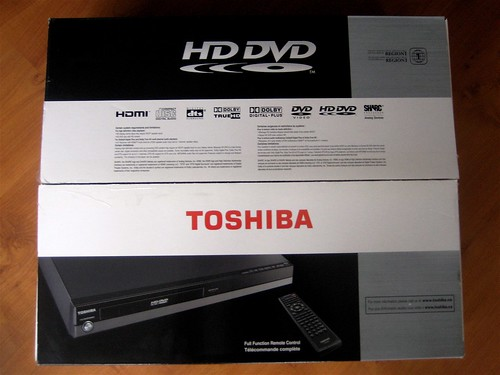

Today I went out for a nice walk, thinking I was going to get a few housewares for my place, and maybe pick up a new shirt or two. While out and about, I decided to swing by Future Shop and see what was new and exciting. When I walked in, I headed over to the DVD player area to see if anything was happening in the Blue-Ray or HD-DVD markets, since I’ve been looking to pick something up for a while.

Last week, there was a sale on the highly regarded Toshiba HD-A2 DVD player for $399, and I almost picked one up. However, that was still a little steep for my liking, and I decided to pass on it. When I walked in today though, I noticed right away that the same DVD player was now listed for $349, and it came with three HD-DVDs in the box. Well, that deal was too sweet for me to pass up, so I threw the cash down and walked away with it.

  
  
First problem was that the box was huge and I had walked to Future Shop. So, I’m pretty sure I looked really stupid waddling down Granville Street afterwards carrying this huge ass box in both hands. But whatever, I was happy waddling into the sunset.

I knew going into this that I would need a HDMI cable to pull it off properly, but I just wasn’t willing to shell out another $50 to Future Shop for one of those. So, for now at least, I had to hook it up using the component cables. What that means it that I won’t be able to watch upscaled normal DVD movies using the new DVD player, and that some of the HD-DVDs actually will play as low-def. But for now at least, most of the HD-DVDs will play normally, and I’ll shop for a cheap HDMI-DVI converter for my TV.

The first thing the guy at Future Shop warned me about is to make sure I upgrade the firmware on it, since the firmware that it ships with is a bit buggy. After using the DVD player for a few hours, I can basically say that he’s 100% right. While the image looks pretty amazing with a real HD-DVD in the player, I’ve had a few cases where it’s thought there were errors in the stream, even though the discs are brand new and never been touched. I popped in a few episodes of 24, and it stuttered in a few places.

I tried downloading an ISO for the new firmware for the HD-DVD player, but unfortunately the DVD player won’t recognize the CD I made for it (which is weird because I followed the directions normally, and I know how to make a CD). So the only other option is to try and get the DVD player on the Internet so it can upgrade itself (which basically means hauling some cables around my place).

HD-DVD players have been historically slow to use in terms of navigating menus and loadings discs, but so far I’ve been pretty happy with this one, and the wait hasn’t seemed excessive. The picture quality is really quite excellent, and I’m anxious to see how my old DVDs look after being upscaled (in theory, this shouldn’t make that big a difference, but people who own upscaling DVD players swear by them, so we’ll see).

Although the winner of the Blue-Ray/HD-DVD war has yet to be decided, I basically put my weight behind HD-DVD with this purchase. I have a hard time believing after this length of time that the industry can simply abandon any one of the two formats — the consumer backlash from people who made purchases would be incredible. I imagine what will happen is that you’ll start seeing dual DVD readers on the market soon (I think there might even be one or two already), as well as dual sided discs (Blue-Ray on one side, and HD-DVD on the other). Stupid I know, but the industry created this mess.