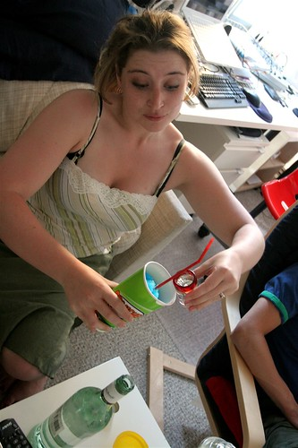

So tonight I felt like having a few drinks, so I pinged Rebecca online and asked if it was ok if I showed up with a bunch of booze. In pure Surrey girl fashion, she said “yeah sure.”

I spent the night hanging out with Rebecca and John, laughing my ass off to Canadian Top Models and some Comedy Show on the TV. I don’t do simple things like that enough these days, and it’s always nice just to relax on someone else’s couch from time to time.

While outside, we were privileged enough to see a weird naked girl across the street, plus a bunch of people in the highrise across the road who thought sunset photos would turn out far better with the flash on, despite the huge distance from them to the setting sun.

In short, great times with friends. Check out [Rebecca’s blog](http://www.miss604.com) for a recap of the Iowa/Surrey/Chilliwack connection.

  
  
Also, I did some work on the photo-of-the-day tonight. It now grabs some EXIF information directly from Flickr. It’s starting to look pretty good, in my humble opinion. I recommend people who are interested go to [the photo of the day](http://photooftheday.duanestorey.com) website instead of viewing the entries inline here, because I’ve done custom work over there. I’ll think of some great way to merge the two at some point, but as of now, you’re stuck with them being separate.

Also, I pinged Leo’s camera in Vancouver, and I’m pretty sure they are going to donate some prizes for my photo of the day, so make sure you start adding photos to the flickr group I created. I’ll let people know when it’s time to start posting lots. Add anything that stands out in your mind, even if you don’t think it won’t stand out in other people’s minds. My goal isn’t to reward people with $3000 cameras, but to showcase unique or heart-felt photographs from everyone’s collection.