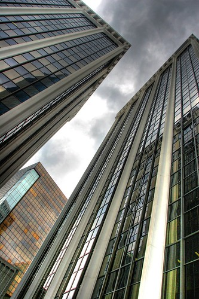

My dad suggested that it might be a cool idea to have a theme every once and a while. So this week, I’ve decided to make the theme:

  
REFLECTIONS  

The idea is that you should take photos of the world that show some type of reflection. Be inventive, but some ideas are puddles, lakes, mirrors, glass, spoons, anything that casts a reflection. Send them in and I’ll try to put them all in a group somewhere to reflect everyone’s efforts!

While not a stellar example, I took a shot today of some buildings with some cool reflections of other buildings in them. However, I’d encourage people to be a bit more inventive than me, and try to capture some views of the world indirectly through some type of reflection.

  
  
Please add all photos to the group, and also add the tag “reflections” so that I can pool them all together. Thanks.